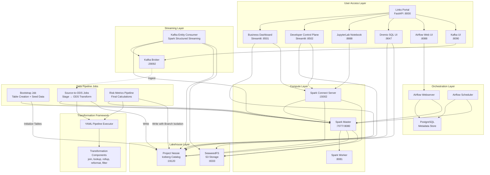
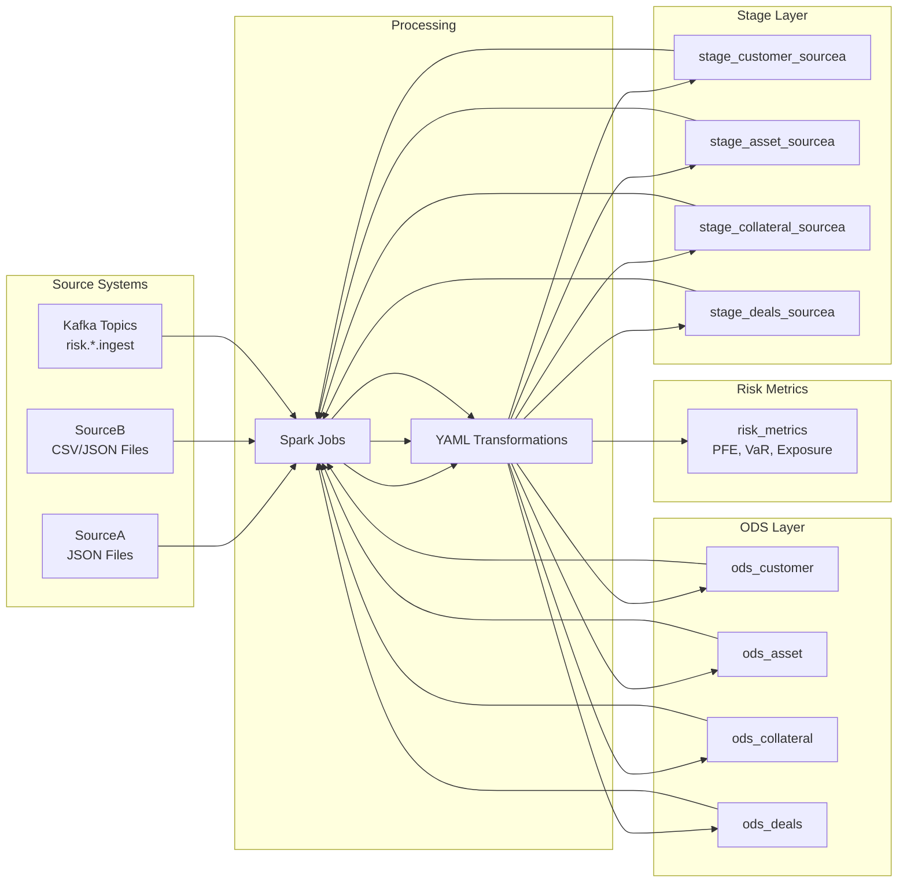
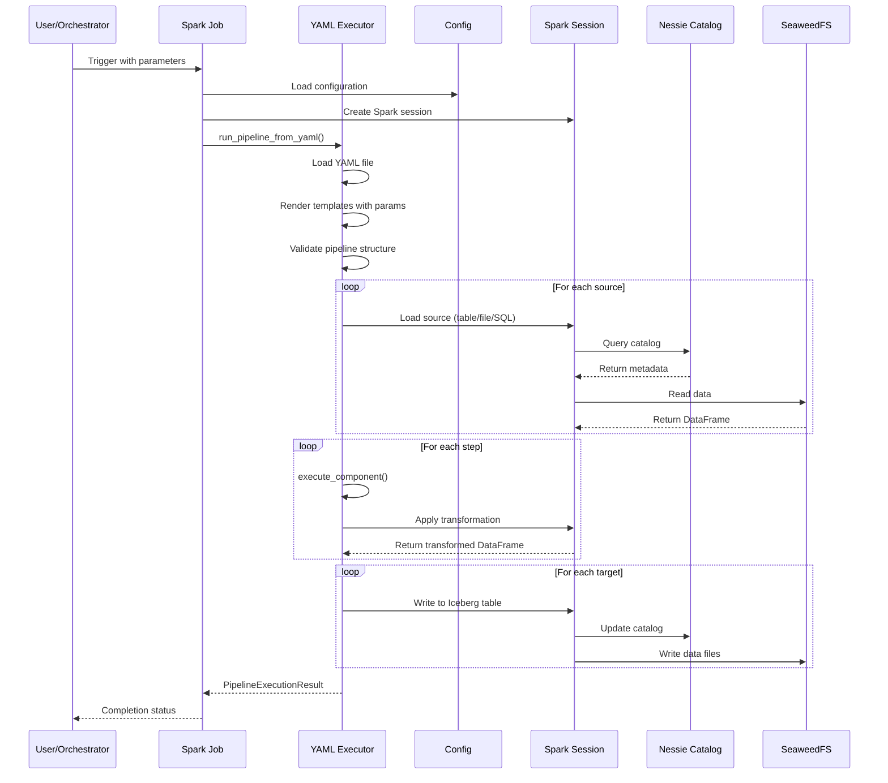
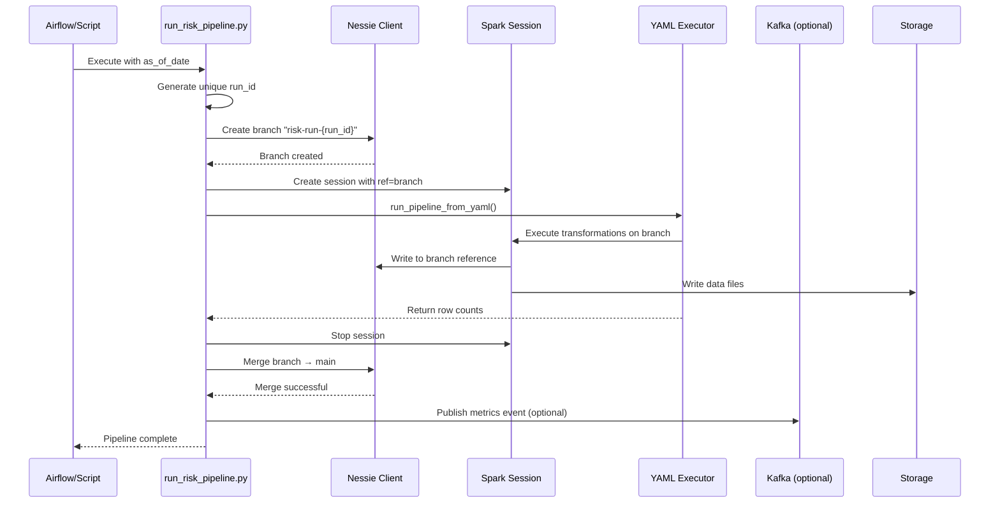
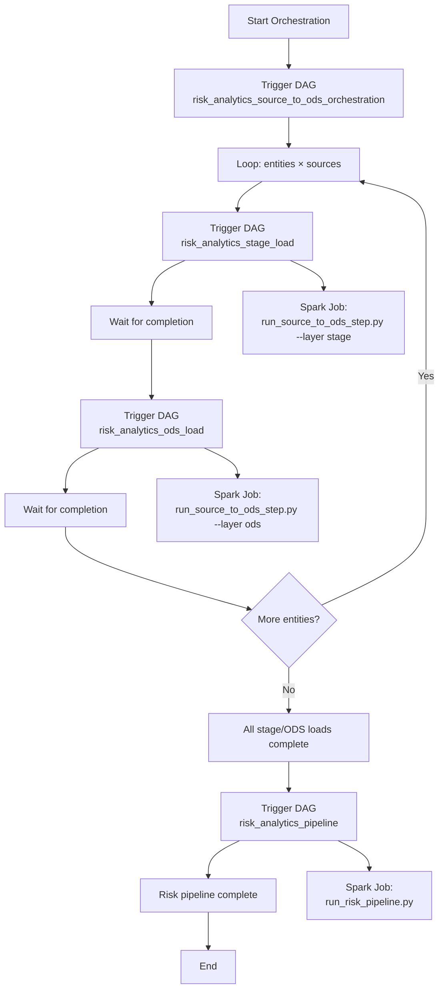

# Risk Analytics Lakehouse - Architecture Diagram

## System Overview

This is a production-oriented data platform for financial risk analytics that implements a modern lakehouse architecture using Apache Spark, Apache Iceberg, Project Nessie, and SeaweedFS.

## High-Level Architecture



## Data Pipeline Flow



## Component Interaction Details

### 1. YAML-Driven Pipeline Execution



### 2. Branch-Isolated Risk Pipeline



### 3. Airflow Orchestration Flow



## Key Design Patterns

### 1. YAML-Driven Transformations
- **Purpose**: Declarative pipeline definitions without code changes
- **Components**: join, lookup, rollup, reformat, filter, normalize, dedup
- **Benefits**: Version-controlled, readable, testable without Spark

### 2. Branch Isolation
- **Purpose**: Prevent incomplete runs from affecting published data
- **Implementation**: Create Nessie branch → Write → Merge on success
- **Fallback**: Direct main write if Nessie unavailable

### 3. Layered Data Architecture
- **Stage**: Raw source data with minimal transformation
- **ODS**: Standardized business entities across sources
- **Metrics**: Final risk calculations (PFE, VaR, exposure)

### 4. Component-Based Framework
- **Dispatcher**: `execute_component()` routes to transformation handlers
- **Contract**: Each component returns (output, used, unused) DataFrames
- **Extensibility**: Add new transformations via component registry

## Technology Stack

| Layer | Technology | Purpose |
|-------|-----------|---------|
| Storage | SeaweedFS | S3-compatible object storage |
| Catalog | Nessie | Iceberg catalog with Git-like versioning |
| Format | Apache Iceberg | ACID transactions, time travel, schema evolution |
| Compute | Apache Spark 4.1.3 | Distributed data processing |
| Orchestration | Apache Airflow 2.10.5 | Workflow scheduling |
| Streaming | Kafka | Real-time data ingestion |
| Query | Dremio | SQL query engine for Iceberg |
| UI | Streamlit | Business/developer dashboards |
| Notebooks | JupyterLab | Interactive analysis |
| Language | Python 3.11 | Primary implementation language |

## Data Model

### Entities
- **Customer**: Counterparty information with ratings and entity types
- **Asset**: Financial instruments with ISIN, asset class, valuations
- **Collateral**: Collateral agreements with asset assignments
- **Deals**: Trade positions with product details and risk factors

### Risk Metrics
- **Gross Exposure**: Sum of trade exposures before netting
- **Netting Exposure**: Net exposure after netting set aggregation
- **Collateral Value**: Collateral adjusted by haircuts
- **PFE (Potential Future Exposure)**: Stress-tested exposure with multiplier
- **VaR (Value at Risk)**: Volatility-adjusted exposure with confidence interval

## File Structure

```
data_factory/
├── airflow/dags/              # Airflow DAG definitions
├── jobs/                      # Spark job entry points
│   ├── bootstrap.py          # Table creation + seed data
│   ├── run_source_to_ods_step.py  # Stage/ODS transformation
│   ├── run_risk_pipeline.py   # Final risk metrics calculation
│   └── kafka_entity_consumer.py  # Kafka streaming consumer
├── risk_analytics/            # Core framework
│   ├── yaml_executor.py       # YAML pipeline execution engine
│   ├── transformations/       # Transformation components
│   ├── config.py              # Configuration management
│   ├── spark.py               # Spark session factory
│   └── nessie.py              # Nessie client wrapper
├── transform/                 # YAML pipeline definitions
│   ├── source_to_ods/         # Stage/ODS transformation YAMLs
│   └── risk_metrics_pipeline_source_to_ods.yaml
├── data/                      # Sample data files
├── ui/                        # Streamlit applications
├── api/                       # FastAPI links portal
└── docker-compose.yml         # Service orchestration
```

## Execution Modes

1. **Manual Execution**: Direct spark-submit commands
2. **Airflow Orchestration**: DAG-based scheduling
3. **Streaming**: Kafka-triggered pipeline execution
4. **Helper Script**: PowerShell script for complete pipeline runs

## Safety Model

- **Branch Isolation**: Each risk run creates a Nessie branch
- **Merge on Success**: Only successful runs merge to main
- **Idempotent Operations**: Bootstrap safe to repeat
- **Validation**: Health checks for service connectivity
- **Fallback**: Graceful degradation when optional services unavailable
