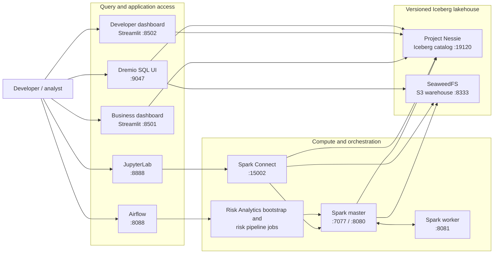

# Risk Analytics Lakehouse

[](https://github.com/sansubrm/data_factory/actions/workflows/docs-pages.yml)
[](https://github.com/sansubrm/data_factory/actions/workflows/docs-pr-check.yml)

Local, production-oriented development scaffold for a Risk Analytics (Risk Analytics) data platform. It combines Spark, Apache Iceberg, Project Nessie, SeaweedFS (S3 API), Airflow, and Streamlit.

## Documentation index

- [README.md](README.md): Quick start, architecture, service access, and operational commands.
- [docs/architecture.md](docs/architecture.md): system design, tech stack, and every architecture diagram (component, orchestration, streaming, YAML execution, branch isolation).
- [docs/data-model-risk-metrics.md](docs/data-model-risk-metrics.md): table contracts per layer, Kafka topic-to-table mapping, lineage, and metric formulas.
- [docs/project-reference.md](docs/project-reference.md): what every file in the repository is for, plus the configuration guide.
- [docs/scripts-reference.md](docs/scripts-reference.md): why each `scripts/` entry exists, when to use it, and its steps.
- [docs/dependency-cache-guide.md](docs/dependency-cache-guide.md): Where dependencies are downloaded/cached and how to inspect underlying Docker files and volumes.

## Documentation website

You can browse project markdowns as a website using MkDocs.

- Published docs URL: https://sansubrm.github.io/data_factory/

Quick links:

- Framework overview: [docs/architecture.md](docs/architecture.md)
- Troubleshooting: [docs/troubleshooting.md](docs/troubleshooting.md)
- Runbooks: [docs/runbooks.md](docs/runbooks.md)

```powershell
pip install mkdocs mkdocs-material
mkdocs serve
```

Then open `http://127.0.0.1:8000`.

For first deployment, enable GitHub Pages with source set to GitHub Actions in repository settings.

## High-level architecture



## How to start and run

### Prerequisites

- Install and start [Docker Desktop](https://www.docker.com/products/docker-desktop/).
- Open PowerShell and confirm Docker is available:

  ```powershell
  docker --version
  docker compose version
  ```

### Start the local platform

1. Open PowerShell in the project directory:

   ```powershell
   cd C:\Users\Sankar\OneDrive\Documents\data_factory
   ```

2. Create the local environment file:

   ```powershell
   Copy-Item .env.example .env
   ```

   The included values are development credentials. Change them in `.env` if your environment requires different credentials.

3. Build the project images and start the complete local platform:

   ```powershell
   docker compose up --build -d
   ```

   This initializes the SeaweedFS bucket and Airflow database automatically. The default Airflow credentials are `admin` / `admin`.

4. Confirm the services are running:

   ```powershell
   docker compose ps --all
   ```

   `storage-init` and `airflow-init` should show `Exited (0)`; that is expected because they are one-time initialization tasks. The long-running services should show `Up`, including `spark-master`, `spark-worker`, `spark-connect`, `notebook`, `dremio`, `nessie`, `seaweedfs`, `airflow-webserver`, `airflow-scheduler`, `airflow-triggerer`, `business-ui`, and `developer-ui`.

### Load data and run the risk pipeline

You can either run the jobs manually, or use the helper script in [scripts/run_risk_analytics_pipeline.ps1](scripts/run_risk_analytics_pipeline.ps1).

1. Create the Iceberg tables and load the included sample data:

   ```powershell
   docker compose exec spark-master /opt/spark/bin/spark-submit --master spark://spark-master:7077 /opt/risk_analytics/jobs/bootstrap.py
   ```

2. Run stage and ODS jobs (example: customer SourceA):

   The new parameterized job runner executes stage and ODS steps for each entity/source pair.

   ```powershell
   docker compose exec spark-master /opt/spark/bin/spark-submit --master spark://spark-master:7077 /opt/risk_analytics/jobs/run_source_to_ods_step.py --layer stage --entity customer --source sourcea --as-of-date 2026-07-18
   docker compose exec spark-master /opt/spark/bin/spark-submit --master spark://spark-master:7077 /opt/risk_analytics/jobs/run_source_to_ods_step.py --layer ods --entity customer --source sourcea --as-of-date 2026-07-18
   ```

   For SourceB file inputs, include path parameters, for example:

   ```powershell
   docker compose exec spark-master /opt/spark/bin/spark-submit --master spark://spark-master:7077 /opt/risk_analytics/jobs/run_source_to_ods_step.py --layer stage --entity customer --source sourceb --as-of-date 2026-07-18 --param customer_sourceb_path=/opt/risk_analytics/data/sourceb/customer/*.csv
   docker compose exec spark-master /opt/spark/bin/spark-submit --master spark://spark-master:7077 /opt/risk_analytics/jobs/run_source_to_ods_step.py --layer ods --entity customer --source sourceb --as-of-date 2026-07-18 --param customer_sourceb_path=/opt/risk_analytics/data/sourceb/customer/*.csv
   ```

3. Run the final risk metrics calculation and publish its metrics:

   ```powershell
   docker compose exec spark-master /opt/spark/bin/spark-submit --master spark://spark-master:7077 /opt/risk_analytics/jobs/run_risk_pipeline.py --as-of-date 2026-07-18 --data-model source-to-ods
   ```

   The job writes to a temporary Nessie branch and merges the output into `main` after a successful run.

4. Or orchestrate through Airflow with DAG order:

   1. `ra_createtables_and_data` — creates every table, seeds the Source A/Source B raw tables, then triggers the orchestration below.
   2. `ra_stage_to_ods_orchestration` — one task group per source/entity triggers `ra_<source>_<entity>_stage`, waits for it, then `ra_<source>_<entity>_ods`. The eight groups run concurrently; the waits are deferred (they need the `airflow-triggerer` service) and the spark-submit tasks share the `spark_submit` Airflow pool, whose slot count is set from `SPARK_SUBMIT_POOL_SLOTS` (default 2).
   3. `ra_riskmetrics_eval_ods` — final risk metric evaluation over ODS, triggered automatically once all ODS loads finish.

   The per-entity DAGs can also be triggered on their own:

   | Layer | DAG IDs | YAML definition |
   | --- | --- | --- |
   | STAGE | `ra_sourceA_customer_stage`, `ra_sourceB_customer_stage`, `ra_sourceA_asset_stage`, `ra_sourceB_asset_stage`, `ra_sourceA_collateral_stage`, `ra_sourceB_collateral_stage`, `ra_sourceA_deals_stage`, `ra_sourceB_deals_stage` | `transform/source_to_ods/stage_<entity>_<source>.yaml` |
   | ODS | `ra_sourceA_customer_ods`, `ra_sourceB_customer_ods`, `ra_sourceA_asset_ods`, `ra_sourceB_asset_ods`, `ra_sourceA_collateral_ods`, `ra_sourceB_collateral_ods`, `ra_sourceA_deals_ods`, `ra_sourceB_deals_ods` | `transform/source_to_ods/ods_<entity>_<source>.yaml` |
   | Streaming | `ra_kafka_<entity>_stage` -> `ra_kafka_<entity>_ods` -> `ra_riskmetrics_eval_ods` for `customer`, `asset`, `collateral`, and `deals` | same STAGE/ODS YAML files as the batch DAGs |

5. Or run the full platform helper script:

   ```powershell
   .\scripts\run_risk_analytics_pipeline.ps1 -AsOfDate 2026-07-18
   ```

   For first-time setup (build images + warm dependency cache), run:

   ```powershell
   .\scripts\run_risk_analytics_pipeline.ps1 -AsOfDate 2026-07-18 -PlatformMode first-build
   ```

   For regular runs (no image build, mostly offline after first build), run:

   ```powershell
   .\scripts\run_risk_analytics_pipeline.ps1 -AsOfDate 2026-07-18 -PlatformMode offline
   ```

   `offline` mode is strict: it starts only locally cached images with no image pull, build, or runtime dependency download. If required images are absent, it stops and directs you to run `first-build` while connected.

   The helper starts the Docker platform, verifies that all 27 `ra_*` DAGs are registered, unpauses them, triggers `ra_createtables_and_data`, waits for the bootstrap, orchestration, and `ra_riskmetrics_eval_ods` runs to succeed, and finishes with a validation query that checks the loaded tables.

   If Airflow does not know the expected DAGs, the script stops with the remediation steps instead of triggering an unknown DAG. If Airflow still lists pre-refactor `risk_analytics_*` DAGs (metadata from an earlier revision that has no DAG file), the script warns; add `-RemoveLegacyDags` to delete those entries:

   ```powershell
   .\scripts\run_risk_analytics_pipeline.ps1 -AsOfDate 2026-07-18 -RemoveLegacyDags
   ```

   The wait is bounded by `-WaitTimeoutMinutes` (default 60). Use `-SkipPipelineWait` to trigger and return immediately, accepting that the validation query can run before the ODS tables exist.

   Add `-OpenEndpoints` if you want the script to open the main browser pages after a successful run:

   ```powershell
   .\scripts\run_risk_analytics_pipeline.ps1 -AsOfDate 2026-07-18 -PlatformMode offline -OpenEndpoints
   ```

   If PowerShell blocks local scripts with `UnauthorizedAccess` or "running scripts is disabled on this system", temporarily allow scripts for the current shell session:

   ```powershell
   Set-ExecutionPolicy -Scope Process -ExecutionPolicy Bypass
   .\scripts\run_risk_analytics_pipeline.ps1 -AsOfDate 2026-07-18
   ```

### Open the applications

| Application | Address | Credentials |
| --- | --- | --- |
| Business dashboard | http://localhost:8501 | None |
| Developer control plane | http://localhost:8502 | None |
| Operations API and links portal | http://localhost:8000 | None |
| Airflow | http://localhost:8088 | `admin` / `admin` |
| Spark master | http://localhost:8080 | None |
| JupyterLab notebook | http://localhost:8888 | None (local development only) |
| Dremio Community | http://localhost:9047 | Create an account on first visit |
| Nessie catalog UI | http://localhost:19120/tree/main | None |
| Nessie API | http://localhost:19120/api/v2 | None |
| Kafka UI | http://localhost:8090 | None |

### Enhanced UI Features

#### Developer Control Plane (http://localhost:8502)

The Developer UI provides comprehensive platform management and pipeline orchestration through a tabbed interface:

**Platform Management Tab:**
- Check Docker Compose platform status
- Start/Stop the complete platform with optional rebuild
- Auto-refresh service status display
- View individual service states and ports
- Probe `GET /health` (API, Spark, Nessie) and list the catalog through `GET /tables`

**Data Pipeline Tab:**
- **Bootstrap**: Create tables and load seed data via DAG or direct execution
- **Source-to-ODS**: Run stage and ODS transformations for customer, asset, collateral, and deals entities
  - Select multiple entities and sources (SourceA/SourceB)
  - Configure SourceB file paths
  - Progress tracking for batch execution
- **Risk Metrics**: Trigger final risk calculations with data model selection
- **Operations API**: Call `POST /pipeline/execute` for the `bootstrap`, `orchestration`, `stage`, `ods`, and `riskmetrics` targets

**Data Viewer Tab:**
- View row counts for all lakehouse tables
- Preview table data with configurable row limits
- Filter by as-of-date

**Airflow Monitoring Tab:**
- One table with every `ra_*` DAG joined to its live Airflow state, filterable by layer, source, and entity
- Warns about DAGs the scheduler has not registered
- Inspect recent runs for a selected DAG, or trigger it for the chosen as-of date
- Access risk run history with trend visualization

**Kafka Streaming Tab:**
- View all Kafka topics
- Get topic statistics and partition information
- Publish test events to risk topics
- Trigger pipeline execution after Kafka events

**Pipeline Studio Tab:**
- Edit, validate, and execute YAML transformation pipelines
- Preview rendered YAML with runtime parameters
- Save pipeline modifications

#### Business Dashboard (http://localhost:8501)

The Business UI provides real-time risk metrics and operational monitoring:

**Risk Metrics Tab:**
- Portfolio summary with Total PFE, VaR, Netting Exposure, and record counts
- Customer-level filtering and exposure breakdown
- Detailed risk metrics table with all key columns
- As-of-date filtering for temporal analysis

**Pipeline Status Tab:**
- Latest run state for every `ra_*` DAG in one table, filtered by layer and source
- Run-state totals across the selected DAGs
- Check data freshness across all tables

**Streaming Monitor Tab:**
- Kafka topic listing with partition information
- Per-entity view of the `ra_kafka_<entity>_stage` and `ra_kafka_<entity>_ods` DAG state next to its ingest topic
- Topic offset checks

**Historical Runs Tab:**
- View complete risk calculation history
- PFE trend analysis over time
- Run summary metrics and detailed execution records
- Average records per run and latest exposure values

**Features:**
- Auto-refresh every 30 seconds for real-time monitoring
- Sidebar health summary sourced from the operations API `/health` probe
- Customer filtering for focused analysis
- Comprehensive error handling and status messages

### Query data in JupyterLab through Spark Connect

After the platform is running and the pipeline has published data, open http://localhost:8888 and create a Python notebook. The local notebook has no login configured, so do not expose port 8888 outside your development machine. It connects to Spark through Spark Connect, which is available at `sc://spark-connect:15002` inside Docker and `sc://localhost:15002` from your host machine.

Run the following in a notebook cell to query the published Iceberg tables:

```python
from pyspark.sql import SparkSession

spark = SparkSession.builder.remote("sc://spark-connect:15002").getOrCreate()
spark.table("nessie.risk_analytics_ods.risk_metrics").show()
```

For a local notebook running outside Docker, install `pyspark[connect]==4.1.3` and connect to `sc://localhost:15002` instead.

Spark Connect and JupyterLab provide notebook access, while Dremio provides a SQL-focused browser interface for the same Nessie/Iceberg data.

Ready-to-use notebooks are available under [notebooks](notebooks):

- [notebooks/risk_analytics_spark_connect_nessie_queries.ipynb](notebooks/risk_analytics_spark_connect_nessie_queries.ipynb): Spark Connect queries for risk data, Iceberg snapshots, and Nessie branches.
- [notebooks/risk_analytics_operational_checks.ipynb](notebooks/risk_analytics_operational_checks.ipynb): smoke-test notebook for service connectivity and catalog visibility.

### Use the operations API

The FastAPI service on http://localhost:8000 serves the links portal and operational endpoints:

| Endpoint | Purpose |
| --- | --- |
| `GET /health` | API, Spark Connect, and Nessie catalog status (`?include_spark=false` skips the Spark round trip). |
| `GET /tables` | Iceberg tables per configured namespace in the Nessie catalog. |
| `POST /pipeline/execute` | Triggers a pipeline run: `target` is one of `bootstrap`, `orchestration`, `stage`, `ods`, `riskmetrics`. |

```powershell
Invoke-RestMethod http://localhost:8000/health
Invoke-RestMethod http://localhost:8000/tables
Invoke-RestMethod -Method Post http://localhost:8000/pipeline/execute -ContentType application/json -Body '{"target":"orchestration","as_of_date":"2026-07-18"}'
```

### Run the health-check job

Use [scripts/health_check.py](scripts/health_check.py) to validate that required services are reachable and behaving as expected.

Command line usage:

```powershell
# Core service health checks (HTTP and TCP)
docker compose exec business-ui python /opt/risk_analytics/scripts/health_check.py

# Deep check including Spark Connect + Iceberg catalog query
docker compose exec business-ui python /opt/risk_analytics/scripts/health_check.py --check-iceberg
```

VS Code task usage:

1. Open Command Palette and run **Tasks: Run Task**.
2. Select `risk-analytics-health-check` for standard checks.
3. Select `risk-analytics-health-check-iceberg` for the deep catalog/query check.

The script exits with code `0` on success and `1` if any required check fails. It answers "are the
services reachable?"; run [scripts/validate_pipeline_status.py](scripts/validate_pipeline_status.py)
for the next question, "is the platform loaded correctly?" — it compares Airflow's registered DAGs
against the 27 shipped `ra_*` DAGs, flags leftover `risk_analytics_*` metadata and paused DAGs, and
queries the ODS layer.

Every script in `scripts/` — why it exists, when to use it, and what each step does — is documented in
[docs/scripts-reference.md](docs/scripts-reference.md).

### Query the lakehouse in Dremio

Dremio Community is included for local exploration only. On its first startup, it may take up to two minutes before the UI is available at http://localhost:9047. Create the initial local Dremio account, then connect it to the existing Nessie catalog:

1. On the **Datasets** page, select **Add Source**, then choose **Nessie**.
2. Use `risk_analytics_nessie` as the source name.
3. Set the Nessie endpoint URL to `http://nessie:19120/api/v2` and select **None** for Nessie authentication.
4. In **Storage**, choose **AWS** and provide the following values:

   | Setting | Value |
   | --- | --- |
   | AWS root path | `risk-analytics-lakehouse/warehouse` |
   | Authentication method | AWS Access Key |
   | AWS access key | `risk_analytics_admin` |
   | AWS access secret | `risk_analytics_local_development_secret` |

   Use the matching values from `.env` if you changed the development credentials.
5. Under **Other: Connection Properties**, add these properties:

   | Name | Value |
   | --- | --- |
   | `fs.s3a.path.style.access` | `true` |
   | `fs.s3a.endpoint` | `seaweedfs:8333` |
   | `dremio.s3.compat` | `true` |

6. Save the source. The published tables appear beneath `risk_analytics_nessie` on the `main` branch. For example, run this query in Dremio's SQL Runner:

   ```sql
   SELECT *
   FROM risk_analytics_nessie.risk_analytics_ods.risk_metrics;
   ```

   You can also trigger the pipeline in Airflow: open the `ra_createtables_and_data` DAG (for full create+seed+orchestration) or `ra_stage_to_ods_orchestration` DAG (for stage+ODS+final runs on existing tables), then select **Trigger DAG**.

### Useful commands

```powershell
# Follow logs when diagnosing a problem
docker compose logs -f spark-master
docker compose logs -f airflow-webserver
docker compose logs -f storage-init

# Run Python health checks for core services (recommended inside business-ui container)
docker compose exec business-ui python /opt/risk_analytics/scripts/health_check.py

# Run deeper check including Spark Connect query to Iceberg
docker compose exec business-ui python /opt/risk_analytics/scripts/health_check.py --check-iceberg

# Stop services while retaining local data
docker compose down

# Start the platform again later
docker compose up -d

# Remove services and all local Docker volumes for a clean start
docker compose down -v
```

The default catalog is `nessie`. Stage tables are written beneath `risk_analytics_stage` and standardized ODS tables (including `risk_metrics`) are written beneath `risk_analytics_ods`.

### Development checks

`setup_venv.py` installs `requirements/dev.txt` alongside the runtime groups, so the same gates CI runs are available locally:

```powershell
.\.venv\Scripts\python.exe -m unittest discover -s tests -p "test_*.py" -t .
.\.venv\Scripts
uff.exe check .
.\.venv\Scripts\mypy.exe --config-file mypy.ini
$env:PYTHONPATH = (Get-Location).Path; .\.venv\Scripts\python.exe scriptsalidate_dags.py
mkdocs build --strict
docker compose config --quiet
```

`scripts/validate_dags.py` parses `airflow/dags` with a real Airflow `DagBag` and fails on import errors, missing DAG ids, or DAGs without tasks. [.github/workflows/ci.yml](.github/workflows/ci.yml) runs all of the above on every pull request.

## Safety model

The risk job creates an isolated Nessie branch, writes the run output there, and merges it into `main` only after the write succeeds. This makes data commits reviewable and prevents incomplete runs from altering the published risk view.

