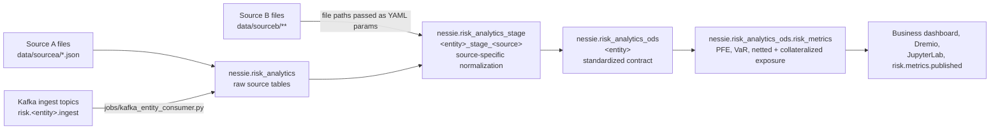
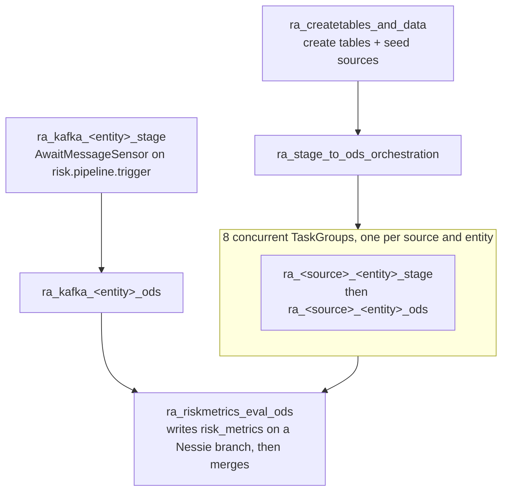

# Risk Analytics Lakehouse

[](https://github.com/sankarasub/riskanalytics_df/actions/workflows/docs-pages.yml)
[](https://github.com/sankarasub/riskanalytics_df/actions/workflows/docs-pr-check.yml)

A counterparty-risk lakehouse that runs on your machine through Docker Compose OR locally without Docker. It ingests two differently-shaped source systems, standardizes them through STAGE and ODS layers, and publishes counterparty risk metrics (PFE, VaR, netted and collateralized exposure) as a versioned Iceberg table.

What makes it more than a demo:

- **Transformations are metadata, not code.** Every STAGE and ODS load is a YAML file executed by `risk_analytics/yaml_executor.py`, so a business rule change is a reviewable data change.
- **Publication is atomic and reviewable.** The risk job writes to its own Nessie branch and merges to `main` only after the run succeeds, so a half-finished run can never be read as published truth.
- **Batch and streaming share one contract.** Kafka events land in the same source tables as the batch seed, so both paths use the same STAGE/ODS YAML and produce identical ODS output.
- **Flexible execution modes.** Run locally without Docker (fastest development), hybrid mode (local Spark + remote catalog/storage), or full Docker stack (production-like).
- **Unified React UI.** Single modern web application combining business dashboard, developer tools, data explorer, and configuration management.

## At a glance

| | |
| --- | --- |
| Entities | `customer`, `asset`, `collateral`, `deals` |
| Sources | Source A (JSON, pre-seeded) and Source B (CSV/JSON files, different column names and date formats) |
| Layers | `nessie.risk_analytics` (raw) -> `nessie.risk_analytics_stage` -> `nessie.risk_analytics_ods` -> `nessie.risk_analytics_ods.risk_metrics` |
| Published metrics | `deal_exposure`, `netted_exposure`, `collateralized_exposure`, `pfe`, `var` per counterparty and as-of date |
| Orchestration | 27 Airflow DAGs: 1 bootstrap, 1 orchestrator, 16 batch STAGE/ODS, 8 Kafka, 1 risk evaluation |
| Interfaces | Unified React UI, Streamlit x2, FastAPI, Airflow, JupyterLab, Dremio, Kafka UI |
| Stack | Spark 4.1.3, Iceberg, Nessie 0.104.3, Airflow 2.10.5, Kafka 7.7.1, SeaweedFS (S3), Postgres, Python 3.11, React 18 |
| Runtime | Docker Compose OR local execution, ~10 GB RAM recommended for Docker, ~4 GB for local mode |

## Documentation index

- [README.md](README.md): Quick start, execution modes, architecture, service access, and operational commands.
- [HYBRID_SETUP.md](HYBRID_SETUP.md): Detailed guide for hybrid/local execution modes and unified React UI setup.
- [docs/architecture.md](docs/architecture.md): system design, tech stack, and every architecture diagram (component, orchestration, streaming, YAML execution, branch isolation).
- [docs/architecture_simplification.md](docs/architecture_simplification.md): simplified architecture details for local and hybrid execution modes.
- [docs/data-model-risk-metrics.md](docs/data-model-risk-metrics.md): table contracts per layer, Kafka topic-to-table mapping, lineage, and metric formulas.
- [docs/logging_and_monitoring.md](docs/logging_and_monitoring.md): centralized logging system, performance metrics, and Splunk integration.
- [docs/project-reference.md](docs/project-reference.md): what every file in the repository is for, plus the configuration guide.
- [docs/runbooks.md](docs/runbooks.md): step-by-step execution procedures for all execution modes (local, hybrid, Docker).
- [docs/scripts-reference.md](docs/scripts-reference.md): why each `scripts/` entry exists, when to use it, and its steps.
- [docs/dependency-cache-guide.md](docs/dependency-cache-guide.md): Where dependencies are downloaded/cached and how to inspect underlying Docker files and volumes.

## Documentation website

You can browse project markdowns as a website using MkDocs.

- Published docs URL: https://sankarasub.github.io/riskanalytics_df/

Quick links:

- Framework overview: [docs/architecture.md](docs/architecture.md)
- Troubleshooting: [docs/troubleshooting.md](docs/troubleshooting.md)
- Runbooks: [docs/runbooks.md](docs/runbooks.md)

```powershell
pip install mkdocs mkdocs-material
mkdocs serve
```

Then open `http://127.0.0.1:8000`.

For first deployment, enable GitHub Pages with source set to GitHub Actions in repository settings.

## Data flow

This is the flow to understand first: what turns source files and Kafka events into published risk metrics. Both paths converge on the same tables.



Each arrow between layers is a YAML pipeline, not hand-written Spark code:

| Step | Definition | Runner |
| --- | --- | --- |
| raw -> STAGE | `transform/source_to_ods/stage_<entity>_<source>.yaml` | `jobs/run_source_to_ods_step.py --layer stage` |
| STAGE -> ODS | `transform/source_to_ods/ods_<entity>_<source>.yaml` | `jobs/run_source_to_ods_step.py --layer ods` |
| ODS -> metrics | `transform/source_to_ods/risk_metrics_pipeline_source_to_ods.yaml` | `jobs/run_risk_pipeline.py` |

## Orchestration



The waits are deferred, so the `airflow-triggerer` service must be running. All `spark-submit` tasks share the `spark_submit` pool (`SPARK_SUBMIT_POOL_SLOTS`, default 2) so eight concurrent groups cannot start eight JVMs at once.

## Platform services

```mermaid
flowchart LR
    user["Developer / analyst"]

    subgraph access["Access - browser"]
        business["Business dashboard<br/>Streamlit :8501"]
        developer["Developer control plane<br/>Streamlit :8502"]
        api["Operations API + links portal<br/>FastAPI :8000"]
        airflowui["Airflow :8088"]
        notebook["JupyterLab :8888"]
        dremio["Dremio SQL :9047"]
        kafkaui["Kafka UI :8090"]
    end

    subgraph orchestration["Orchestration"]
        scheduler["airflow-scheduler<br/>+ webserver"]
        triggerer["airflow-triggerer<br/>deferred waits, Kafka sensors"]
        pg["postgres<br/>Airflow metadata"]
    end

    subgraph streaming["Streaming"]
        kafka["Kafka :29092<br/>ingest + trigger topics"]
        stream["kafka-entity-stream<br/>Structured Streaming consumer"]
    end

    subgraph compute["Compute"]
        connect["Spark Connect :15002<br/>UIs, API, notebooks"]
        master["Spark master :7077 / UI :8080"]
        worker["Spark worker UI :8081"]
    end

    subgraph lakehouse["Versioned Iceberg lakehouse"]
        nessie["Project Nessie :19120<br/>Iceberg catalog, branches"]
        storage["SeaweedFS S3 :8333<br/>warehouse files"]
    end

    user --> access
    access --> orchestration
    access --> compute
    orchestration -->|"spark-submit per task"| compute
    orchestration <-->|"trigger events"| streaming
    streaming --> compute
    compute --> lakehouse
    access -->|"Dremio reads the catalog directly"| lakehouse
```



Ports and credentials for each of these are in [Open the applications](#open-the-applications).

## How to start and run

The platform supports three execution modes:

1. **Local Mode** (Fastest): Everything runs locally without Docker - no external services required
2. **Hybrid Mode** (Recommended): Local Spark + remote catalog/storage (Nessie + SeaweedFS)
3. **Docker Mode** (Production-like): Full Docker stack with all services containerized

### Prerequisites

**For all modes:**
- Python 3.8+
- Node.js 16+ and npm (for React UI)
- Required Python packages (install from requirements files)

**For Docker mode:**
- Install and start [Docker Desktop](https://www.docker.com/products/docker-desktop/)
- Open PowerShell and confirm Docker is available:

  ```powershell
  docker --version
  docker compose version
  ```

**For hybrid mode:**
- Docker for running Nessie and SeaweedFS only

### Choose Your Execution Mode

#### Local Mode (No Docker Required)

Best for: Fastest development iteration, no external dependencies, limited resource usage

```powershell
# 1. Open PowerShell in your clone of this repository
cd D:\riskanalytics_df

# 2. Install UI dependencies
cd risk-analytics-ui
npm install
cd ..

# 3. Start the platform in local mode
.\scripts\start_local.ps1

# Or manually start services:
# Terminal 1: Backend
$env:EXECUTION_MODE = "local"
python -m uvicorn api.backend:app --reload --port 8000

# Terminal 2: Frontend  
cd risk-analytics-ui
npm run dev:local
```

The platform will start with:
- Local embedded Spark
- Local filesystem storage
- No external catalog (uses local Iceberg)
- React UI at http://localhost:5173
- Backend API at http://localhost:8000

#### Hybrid Mode (Local Spark + Remote Services)

Best for: Development with production-like catalog/storage, faster than full Docker

```powershell
# 1. Start required services (Nessie + SeaweedFS)
cd D:\riskanalytics_df
docker compose up -d nessie seaweedfs

# 2. Install UI dependencies (if not already done)
cd risk-analytics-ui
npm install
cd ..

# 3. Start the platform in hybrid mode
.\scripts\start_hybrid.ps1

# Or manually start services:
# Terminal 1: Backend
$env:EXECUTION_MODE = "hybrid"
python -m uvicorn api.backend:app --reload --port 8000

# Terminal 2: Frontend
cd risk-analytics-ui
npm run dev:hybrid
```

The platform will start with:
- Local Spark for fast development
- Remote Nessie catalog (http://localhost:19120)
- Remote SeaweedFS storage (http://localhost:8333)
- React UI at http://localhost:5173
- Backend API at http://localhost:8000

#### Docker Mode (Full Stack)

Best for: Production-like testing, full feature parity including streaming

```powershell
# 1. Open PowerShell in your clone of this repository
cd D:\riskanalytics_df

# 2. Create the local environment file
Copy-Item .env.example .env

# 3. Build and start all services
docker compose up --build -d

# 4. Access the React UI
# The React UI will be available at http://localhost:3000
# It connects automatically to Docker services
```

This initializes the SeaweedFS bucket and Airflow database automatically. The default Airflow credentials are `admin` / `admin`.

4. Confirm the services are running (Docker mode only):

   ```powershell
   docker compose ps --all
   ```

   `storage-init` and `airflow-init` should show `Exited (0)`; that is expected because they are one-time initialization tasks. The long-running services should show `Up`, including `spark-master`, `spark-worker`, `spark-connect`, `notebook`, `dremio`, `nessie`, `seaweedfs`, `airflow-webserver`, `airflow-scheduler`, `airflow-triggerer`, `business-ui`, and `developer-ui`.

### Run via helper script

The easiest way to initialize the platform, load data, and run the risk pipeline is using the provided PowerShell script:

```powershell
.\scripts\run_risk_analytics_pipeline.ps1 -AsOfDate 2026-07-18
```

- **First-time setup:** Use `.\scripts\run_risk_analytics_pipeline.ps1 -AsOfDate 2026-07-18 -PlatformMode first-build`
- **Offline runs:** Use `.\scripts\run_risk_analytics_pipeline.ps1 -AsOfDate 2026-07-18 -PlatformMode offline`
- **Automatic UI opening:** Add the `-OpenEndpoints` flag to launch the main browser pages upon successful completion.

> **Note:** If PowerShell blocks local scripts with `UnauthorizedAccess`, temporarily allow scripts for the current shell session using `Set-ExecutionPolicy -Scope Process -ExecutionPolicy Bypass`.

### Load data and run the risk pipeline

#### Using the Unified React UI (Recommended for Local/Hybrid Modes)

1. **Access the React UI** at http://localhost:5173 (local/hybrid) or http://localhost:3000 (Docker)

2. **Navigate to Pipeline Control** page

3. **Set parameters**:
   - As of Date: Select your desired date
   - Entity: Choose from customer, asset, collateral, deals
   - Source: Choose sourcea or sourceb
   - Data Model: source-to-ods (for risk metrics)

4. **Execute pipelines** in order:
   - Click **Bootstrap** to create tables and load sample data
   - Click **Stage** to normalize source data
   - Click **ODS** to standardize to ODS contract
   - Click **Risk Metrics** to calculate and publish risk metrics

5. **Monitor progress** using the pipeline status display

6. **Explore data** using the Data Explorer page to browse created tables

7. **View metrics** using the Risk Metrics page to see calculated risk metrics

#### Using Command Line (All Modes)

You can either run the jobs manually, or use the helper script in [scripts/run_risk_analytics_pipeline.ps1](scripts/run_risk_analytics_pipeline.ps1).

**Docker Mode:**
1. Create the Iceberg tables and load the included sample data:

   ```powershell
   docker compose exec spark-master /opt/spark/bin/spark-submit --master spark://spark-master:7077 /opt/risk_analytics/jobs/bootstrap.py
   ```

2. Run stage and ODS jobs (example: customer SourceA):

   ```powershell
   docker compose exec spark-master /opt/spark/bin/spark-submit --master spark://spark-master:7077 /opt/risk_analytics/jobs/run_source_to_ods_step.py --layer stage --entity customer --source sourcea --as-of-date 2026-07-18
   docker compose exec spark-master /opt/spark/bin/spark-submit --master spark://spark-master:7077 /opt/risk_analytics/jobs/run_source_to_ods_step.py --layer ods --entity customer --source sourcea --as-of-date 2026-07-18
   ```

3. Run the final risk metrics calculation:

   ```powershell
   docker compose exec spark-master /opt/spark/bin/spark-submit --master spark://spark-master:7077 /opt/risk_analytics/jobs/run_risk_pipeline.py --as-of-date 2026-07-18 --data-model source-to-ods
   ```

**Local/Hybrid Mode:**
1. Create the Iceberg tables and load the included sample data:

   ```powershell
   python jobs/bootstrap.py --as-of-date 2026-07-18
   ```

2. Run stage and ODS jobs:

   ```powershell
   python jobs/run_source_to_ods_step.py --layer stage --entity customer --source sourcea --as-of-date 2026-07-18
   python jobs/run_source_to_ods_step.py --layer ods --entity customer --source sourcea --as-of-date 2026-07-18
   ```

3. Run the final risk metrics calculation:

   ```powershell
   python jobs/run_risk_pipeline.py --as-of-date 2026-07-18 --data-model source-to-ods
   ```

4. Or orchestrate through Airflow with DAG order (Docker mode only):

   1. `ra_createtables_and_data` — creates every table, seeds the Source A/Source B raw tables, then triggers the orchestration below.
   2. `ra_stage_to_ods_orchestration` — one task group per source/entity triggers `ra_<source>_<entity>_stage`, waits for it, then `ra_<source>_<entity>_ods`. The eight groups run concurrently; the waits are deferred (they need the `airflow-triggerer` service) and the spark-submit tasks share the `spark_submit` Airflow pool, whose slot count is set from `SPARK_SUBMIT_POOL_SLOTS` (default 2).
   3. `ra_riskmetrics_eval_ods` — final risk metric evaluation over ODS, triggered automatically once all ODS loads finish.

   The per-entity DAGs can also be triggered on their own:

   | Layer | DAG IDs | YAML definition |
   | --- | --- | --- |
   | STAGE | `ra_sourceA_customer_stage`, `ra_sourceB_customer_stage`, `ra_sourceA_asset_stage`, `ra_sourceB_asset_stage`, `ra_sourceA_collateral_stage`, `ra_sourceB_collateral_stage`, `ra_sourceA_deals_stage`, `ra_sourceB_deals_stage` | `transform/source_to_ods/stage_<entity>_<source>.yaml` |
   | ODS | `ra_sourceA_customer_ods`, `ra_sourceB_customer_ods`, `ra_sourceA_asset_ods`, `ra_sourceB_asset_ods`, `ra_sourceA_collateral_ods`, `ra_sourceB_collateral_ods`, `ra_sourceA_deals_ods`, `ra_sourceB_deals_ods` | `transform/source_to_ods/ods_<entity>_<source>.yaml` |
   | Streaming | `ra_kafka_<entity>_stage` -> `ra_kafka_<entity>_ods` -> `ra_riskmetrics_eval_ods` for `customer`, `asset`, `collateral`, and `deals` | same STAGE/ODS YAML files as the batch DAGs |

### Switching Between Execution Modes

To switch between execution modes:

1. **Stop all running services**
   - Local/Hybrid: Stop the PowerShell scripts (Ctrl+C)
   - Docker: `docker compose down`

2. **Set the execution mode**
   ```powershell
   $env:EXECUTION_MODE = "local"    # or "hybrid" or "docker"
   ```

3. **Start services for the new mode**
   - Local: `.\scripts\start_local.ps1`
   - Hybrid: `docker compose up -d nessie seaweedfs` then `.\scripts\start_hybrid.ps1`
   - Docker: `docker compose up -d`

4. **Access the UI** - The React UI automatically adapts to the current execution mode

### Execution Mode Comparison

| Feature | Local Mode | Hybrid Mode | Docker Mode |
| --- | --- | --- | --- |
| **Spark** | Local embedded | Local embedded | Docker cluster |
| **Catalog** | Local filesystem | Remote Nessie | Remote Nessie |
| **Storage** | Local filesystem | Remote SeaweedFS | Remote SeaweedFS |
| **Airflow** | Script-based | Script-based | Full Airflow |
| **Streaming** | Not available | Optional | Full Kafka |
| **Resource Usage** | ~4 GB RAM | ~6 GB RAM | ~10 GB RAM |
| **Startup Time** | Fastest | Fast | Slower |
| **Production Parity** | Low | Medium | High |
| **Development Speed** | Fastest | Fast | Moderate |
| **External Dependencies** | None | Nessie + SeaweedFS | Full Docker stack |

**When to use each mode:**

- **Local Mode**: Quick development iterations, testing individual components, learning the system, limited resources
- **Hybrid Mode**: Development with production-like data persistence, team collaboration, testing catalog features
- **Docker Mode**: Full-system testing, production development, streaming features, complete feature parity

### Open the applications

#### Unified React UI (New - Recommended)

| Mode | Address | Description |
| --- | --- | --- |
| Local/Hybrid | http://localhost:5173 | Development server with hot reload |
| Docker | http://localhost:3000 | Production build (Docker mode) |
| API | http://localhost:8000 | Backend API with docs at /docs |

The unified React UI provides:
- **Dashboard**: Platform health and execution mode status
- **Risk Metrics**: Business dashboard with risk metrics visualization
- **Pipeline Control**: Developer tools for pipeline execution
- **Data Explorer**: Browse and query catalog tables
- **Configuration**: View and edit platform configuration

#### Legacy Streamlit UIs (Still Available in Docker Mode)

| Application | Address | Credentials |
| --- | --- | --- |
| Business dashboard | http://localhost:8501 | None |
| Developer control plane | http://localhost:8502 | None |
| Operations API and links portal | http://localhost:8000 | None |
| Airflow | http://localhost:8088 | `admin` / `admin` |
| Spark master | http://localhost:8080 | None |
| JupyterLab notebook | http://localhost:8888 | None (local development only) |
| Dremio Community | http://localhost:9047 | Create an account on first visit |
| Nessie catalog UI | http://localhost:19120/tree/main | None |
| Nessie API | http://localhost:19120/api/v2 | None |
| Kafka UI | http://localhost:8090 | None |

### Enhanced UI Features

#### Unified React UI (New - Recommended)

The unified React UI consolidates all functionality into a single modern web application with the following features:

**Dashboard Page:**
- Platform health status (API, Spark, Nessie, Storage)
- Current execution mode display
- Real-time service monitoring with auto-refresh
- Configuration overview

**Risk Metrics Page:**
- Portfolio summary with Total PFE, VaR, Netting Exposure, and record counts
- Customer-level filtering and exposure breakdown
- Detailed risk metrics table with all key columns
- As-of-date filtering for temporal analysis
- Exposure by customer visualization
- Historical metrics trends

**Pipeline Control Page:**
- Execution mode selector (Local/Hybrid/Docker)
- Pipeline parameter configuration (as-of-date, entity, source, data model)
- One-click pipeline execution (Bootstrap, Orchestration, Stage, ODS, Risk Metrics)
- Real-time pipeline status monitoring
- Progress tracking and error reporting

**Data Explorer Page:**
- Browse all catalog tables
- View table schemas with data types
- Query table data with pagination
- Filter and export capabilities
- Real-time data preview

**Configuration Page:**
- View current platform configuration
- Edit configuration in local mode
- Execution mode switching
- Service endpoint management
- Catalog and storage settings

**Features:**
- Responsive design for desktop and tablets
- Auto-refresh for real-time data
- Error handling and loading states
- Mode-aware functionality (features adapt to execution mode)
- Modern Material-UI components

#### Legacy Streamlit UIs (Still Available in Docker Mode)

The legacy Streamlit UIs remain available in Docker mode for backward compatibility:

**Developer Control Plane (http://localhost:8502):**
- Platform Management: Docker Compose status, service health checks
- Data Pipeline: Bootstrap, Source-to-ODS transformations, Risk Metrics
- Data Viewer: Table row counts, data preview with filtering
- Airflow Monitoring: DAG state inspection, run history
- Kafka Streaming: Topic management, event publishing
- Pipeline Studio: YAML pipeline editing and execution

**Business Dashboard (http://localhost:8501):**
- Risk Metrics: Portfolio summary, customer filtering, detailed metrics
- Pipeline Status: DAG run states, data freshness checks
- Streaming Monitor: Kafka topics, streaming DAG status
- Historical Runs: Risk calculation history, PFE trends

### Query data in JupyterLab through Spark Connect

**Docker Mode:**
After the platform is running and the pipeline has published data, open http://localhost:8888 and create a Python notebook. The local notebook has no login configured, so do not expose port 8888 outside your development machine. It connects to Spark through Spark Connect, which is available at `sc://spark-connect:15002` inside Docker and `sc://localhost:15002` from your host machine.

```python
from pyspark.sql import SparkSession

spark = SparkSession.builder.remote("sc://localhost:15002").getOrCreate()
spark.table("nessie.risk_analytics_ods.risk_metrics").show()
```

**Local/Hybrid Mode:**
For local execution, you can create Spark sessions directly without Spark Connect:

```python
from risk_analytics.spark import create_spark_session

spark = create_spark_session("notebook", "main", mode="local")  # or mode="hybrid"
spark.table("local.risk_analytics_ods.risk_metrics").show()  # Use "local" catalog for local mode
spark.table("nessie.risk_analytics_ods.risk_metrics").show()  # Use "nessie" catalog for hybrid mode
```

Spark Connect and JupyterLab provide notebook access, while Dremio provides a SQL-focused browser interface for the same Nessie/Iceberg data.

Ready-to-use notebooks are available under [notebooks](notebooks):

- [notebooks/risk_analytics_spark_connect_nessie_queries.ipynb](notebooks/risk_analytics_spark_connect_nessie_queries.ipynb): Spark Connect queries for risk data, Iceberg snapshots, and Nessie branches.
- [notebooks/risk_analytics_operational_checks.ipynb](notebooks/risk_analytics_operational_checks.ipynb): smoke-test notebook for service connectivity and catalog visibility.

### Use the operations API

The unified FastAPI backend on http://localhost:8000 serves both the React UI and operational endpoints:

**Platform Endpoints:**
| Endpoint | Purpose |
| --- | --- |
| `GET /api/platform/health` | Health check for API, Spark, Nessie, and Storage based on execution mode |
| `GET /api/platform/config` | Get current platform configuration (sanitized) |
| `POST /api/platform/config` | Update platform configuration (local mode only) |

**Pipeline Endpoints:**
| Endpoint | Purpose |
| --- | --- |
| `POST /api/pipeline/execute` | Execute pipeline: `target` is one of `bootstrap`, `orchestration`, `stage`, `ods`, `riskmetrics` |
| `GET /api/pipeline/status` | Get current pipeline execution status |

**Data Endpoints:**
| Endpoint | Purpose |
| --- | --- |
| `GET /api/data/tables` | List all available tables in the catalog |
| `GET /api/data/table/{name}` | Get data from specified table with pagination |
| `GET /api/data/table/{name}/schema` | Get schema for specified table |

**Metrics Endpoints:**
| Endpoint | Purpose |
| --- | --- |
| `GET /api/metrics/summary` | Get risk metrics summary for a date and optional customer |
| `GET /api/metrics/historical` | Get historical risk metrics for trend analysis |

**Legacy Endpoints (Still Available):**
| Endpoint | Purpose |
| --- | --- |
| `GET /health` | API, Spark Connect, and Nessie catalog status (`?include_spark=false` skips the Spark round trip) |
| `GET /tables` | Iceberg tables per configured namespace in the Nessie catalog |
| `POST /pipeline/execute` | Triggers a pipeline run (legacy format) |

```powershell
# New unified API endpoints
Invoke-RestMethod http://localhost:8000/api/platform/health
Invoke-RestMethod http://localhost:8000/api/data/tables
Invoke-RestMethod -Method Post http://localhost:8000/api/pipeline/execute -ContentType application/json -Body '{"target":"orchestration","as_of_date":"2026-07-18"}'

# Legacy endpoints (still work)
Invoke-RestMethod http://localhost:8000/health
Invoke-RestMethod http://localhost:8000/tables
```

### Run the health-check job

Use [scripts/health_check.py](scripts/health_check.py) to validate that required services are reachable and behaving as expected.

**Docker Mode:**
```powershell
# Core service health checks (HTTP and TCP)
docker compose exec business-ui python /opt/risk_analytics/scripts/health_check.py

# Deep check including Spark Connect + Iceberg catalog query
docker compose exec business-ui python /opt/risk_analytics/scripts/health_check.py --check-iceberg
```

**Local/Hybrid Mode:**
```powershell
# Check health via the unified API
Invoke-RestMethod http://localhost:8000/api/platform/health

# Or use the health check script directly
python scripts/health_check.py
```

VS Code task usage:

1. Open Command Palette and run **Tasks: Run Task**.
2. Select `risk-analytics-health-check` for standard checks.
3. `risk-analytics-health-check` already passes `--check-iceberg`, so it also verifies that `risk_metrics` is queryable. `.vscode/tasks.json` holds the other debug tasks (validate DAGs, tail service logs, query the ODS tables, serve the docs).

The script exits with code `0` on success and `1` if any required check fails. It answers "are the
services reachable?"; run [scripts/validate_pipeline_status.py](scripts/validate_pipeline_status.py)
for the next question, "is the platform loaded correctly?" — it compares Airflow's registered DAGs
against the 27 shipped `ra_*` DAGs, flags leftover `risk_analytics_*` metadata and paused DAGs, and
queries the ODS layer.

Every script in `scripts/` — why it exists, when to use it, and what each step does — is documented in
[docs/scripts-reference.md](docs/scripts-reference.md).

### New Startup Scripts

The project includes convenient startup scripts for each execution mode:

**Local Mode Script** (`scripts/start_local.ps1`):
- Starts local Spark with embedded execution
- Creates local data directories if needed
- Launches React UI with local configuration
- No external dependencies required

**Hybrid Mode Script** (`scripts/start_hybrid.ps1`):
- Checks that Nessie and SeaweedFS are running
- Starts local Spark with remote catalog connection
- Launches React UI with hybrid configuration
- Requires `docker compose up -d nessie seaweedfs` first

Both scripts include:
- Automatic service startup and monitoring
- Status messages and error handling
- Clean shutdown on Ctrl+C
- URL information for accessing the UI

### Query the lakehouse in Dremio (Docker/Hybrid Mode Only)

Dremio Community is included for SQL-based data exploration in Docker and hybrid modes. On its first startup, it may take up to two minutes before the UI is available at http://localhost:9047. Create the initial local Dremio account, then connect it to the existing Nessie catalog:

1. On the **Datasets** page, select **Add Source**, then choose **Nessie**.
2. Use `risk_analytics_nessie` as the source name.
3. Set the Nessie endpoint URL to `http://nessie:19120/api/v2` and select **None** for Nessie authentication.
4. In **Storage**, choose **AWS** and provide the following values:

   | Setting | Value |
   | --- | --- |
   | AWS root path | `risk-analytics-lakehouse/warehouse` |
   | Authentication method | AWS Access Key |
   | AWS access key | `risk_analytics_admin` |
   | AWS access secret | `risk_analytics_local_development_secret` |

   Use the matching values from `.env` if you changed the development credentials.
5. Under **Other: Connection Properties**, add these properties:

   | Name | Value |
   | --- | --- |
   | `fs.s3a.path.style.access` | `true` |
   | `fs.s3a.endpoint` | `seaweedfs:8333` |
   | `dremio.s3.compat` | `true` |

6. Save the source. The published tables appear beneath `risk_analytics_nessie` on the `main` branch. For example, run this query in Dremio's SQL Runner:

   ```sql
   SELECT *
   FROM risk_analytics_nessie.risk_analytics_ods.risk_metrics;
   ```

   You can also trigger the pipeline in Airflow: open the `ra_createtables_and_data` DAG (for full create+seed+orchestration) or `ra_stage_to_ods_orchestration` DAG (for stage+ODS+final runs on existing tables), then select **Trigger DAG**.

### Useful commands

**Docker Mode:**
```powershell
# Follow logs when diagnosing a problem
docker compose logs -f spark-master
docker compose logs -f airflow-webserver
docker compose logs -f storage-init

# Run Python health checks for core services (recommended inside business-ui container)
docker compose exec business-ui python /opt/risk_analytics/scripts/health_check.py

# Run deeper check including Spark Connect query to Iceberg
docker compose exec business-ui python /opt/risk_analytics/scripts/health_check.py --check-iceberg

# Stop services while retaining local data
docker compose down

# Stop services and remove volumes (destroys all data)
docker compose down -v
```

**Local/Hybrid Mode:**
```powershell
# Check platform health via API
Invoke-RestMethod http://localhost:8000/api/platform/health

# Check available tables
Invoke-RestMethod http://localhost:8000/api/data/tables

# Execute pipeline via API
Invoke-RestMethod -Method Post http://localhost:8000/api/pipeline/execute -ContentType application/json -Body '{"target":"bootstrap","as_of_date":"2026-07-18"}'

# Stop services (Ctrl+C in the terminal where startup script is running)
```

**Note:** In local mode, data is stored in the local filesystem (`./data/warehouse`). In hybrid and Docker modes, data is stored in SeaweedFS S3-compatible storage. The default catalog name varies by mode: `local` for local mode, `nessie` for hybrid/Docker modes. Stage tables are written beneath the appropriate stage namespace and standardized ODS tables (including `risk_metrics`) are written beneath the ODS namespace.

### Getting Help

For detailed information about the hybrid execution setup and unified React UI, see [HYBRID_SETUP.md](HYBRID_SETUP.md).

For troubleshooting common issues, see [docs/troubleshooting.md](docs/troubleshooting.md).

For operational procedures and runbooks, see [docs/runbooks.md](docs/runbooks.md).

### Development checks

`setup_venv.py` installs `requirements/dev.txt` alongside the runtime groups, so the same gates CI runs are available locally:

```powershell
.\.venv\Scripts\python.exe -m unittest discover -s tests -p "test_*.py" -t .
.\.venv\Scripts\ruff.exe check .
.\.venv\Scripts\mypy.exe --config-file mypy.ini
$env:PYTHONPATH = (Get-Location).Path; .\.venv\Scripts\python.exe scripts\validate_dags.py
mkdocs build --strict
docker compose config --quiet
```

`scripts/validate_dags.py` parses `airflow/dags` with a real Airflow `DagBag` and fails on import errors, missing DAG ids, or DAGs without tasks. [.github/workflows/ci.yml](.github/workflows/ci.yml) runs all of the above on every pull request.

## Safety model

The risk job creates an isolated Nessie branch, writes the run output there, and merges it into `main` only after the write succeeds. This makes data commits reviewable and prevents incomplete runs from altering the published risk view.

## Where to look when something is wrong

| Symptom | Start here |
| --- | --- |
| `TABLE_OR_VIEW_NOT_FOUND: risk_analytics_ods.risk_metrics` | The pipeline has not finished. Run `scripts/validate_pipeline_status.py`; the helper script waits for the DAG runs before validating. |
| Airflow lists `risk_analytics_*` DAGs | Stale metadata from before the rename. Re-run the helper with `-RemoveLegacyDags`. |
| A DAG stays in `deferred` forever | `airflow-triggerer` is not running. |
| A Kafka DAG never wakes up | The consumer publishes to `risk.pipeline.trigger` only when a micro-batch has rows; check `docker compose logs kafka-entity-stream`. |
| A hand-run risk job returns zero rows | `jobs/run_risk_pipeline.py --data-model` defaults to `legacy`, whose tables are never seeded. Pass `--data-model source-to-ods`. |

Full symptom-to-fix table: [docs/troubleshooting.md](docs/troubleshooting.md).

