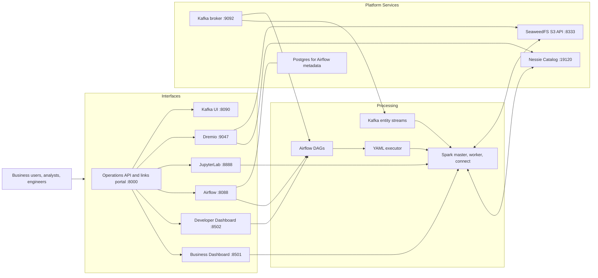
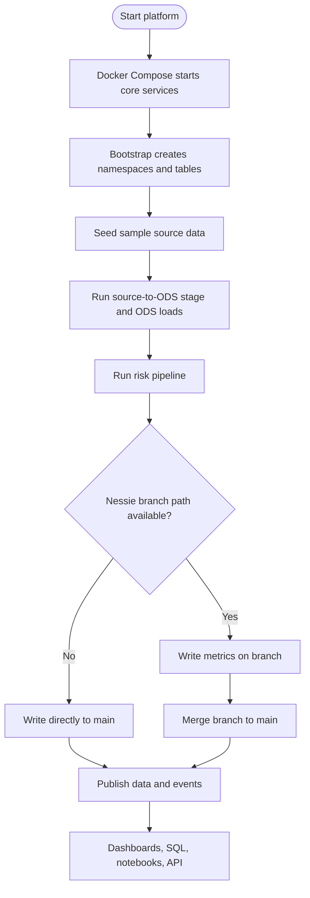
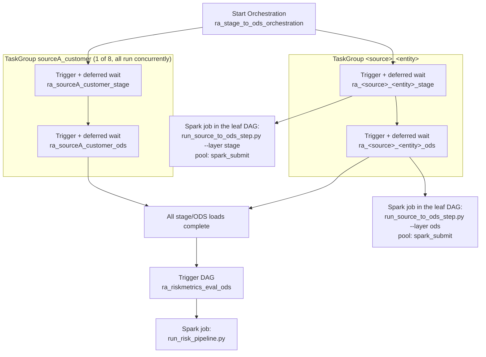
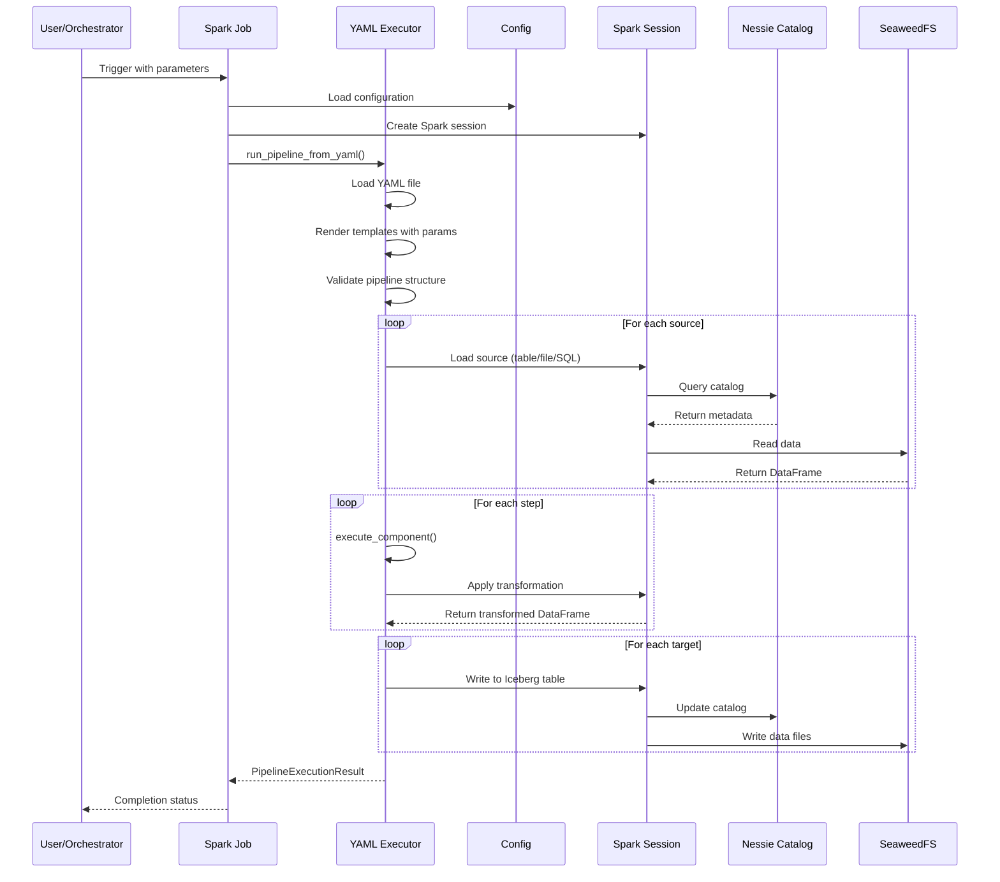
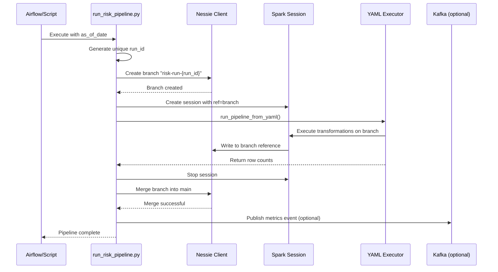
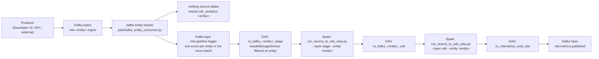

# Framework Overview, System Design & Tech Stack

> Quick links: [Overview](index.md) | [Data Model](data-model-risk-metrics.md) | [Interfaces](platform-interfaces-and-operations.md) | [Runbook](runbooks.md) | [Production Setup](production_setup.md) | [Testing](testing.md)

This page is the single architecture reference: framework overview, system design, technology stack,
and every architecture diagram. It absorbed the former `ARCHITECTURE_DIAGRAM.md` and
`docs/architecture-diagram.md`, which duplicated this content. Table-level contracts and metric
formulas live in [Data Model and Risk Metrics](data-model-risk-metrics.md); the per-file inventory
lives in the [Repository File Guide](project-reference.md).

## What This Platform Runs

The platform supports two coordinated execution paths:

1. Batch orchestration through Airflow for repeatable end-to-end runs.
2. Event-driven ingestion through Kafka plus Spark Structured Streaming.

Both paths publish to Iceberg tables through Nessie Catalog.

## Architecture Principles

- Separate orchestration, compute, catalog, storage, and interface concerns.
- Keep risk assumptions explicit and configuration-driven.
- Keep pipeline logic metadata-driven through YAML definitions.
- Publish only after successful execution, with run traceability.

## Technology Stack

| Technology | Role |
| --- | --- |
| Apache Spark | Distributed transforms, aggregation, and table writes |
| Apache Iceberg | Analytical table format with partition/snapshot semantics |
| Project Nessie | Git-like versioned catalog for branch-isolated writes |
| SeaweedFS S3 API | Local object warehouse for Iceberg data files |
| Apache Airflow | Batch orchestration and DAG observability |
| Apache Kafka | Event-driven trigger and publish channels |
| FastAPI | Links portal and operational endpoints |
| Streamlit | Business and developer dashboards |
| JupyterLab | Interactive notebook analytics (PySpark) |
| Dremio | SQL exploration over Nessie/Iceberg |
| Docker Compose | Repeatable local multi-service platform |

## End-to-End Architecture

Service ports: business UI `8501`, developer UI `8502`, operations API `8000`, Airflow `8088`,
JupyterLab `8888`, Dremio `9047`, Kafka UI `8090`, Nessie `19120`, SeaweedFS S3 `8333`, Spark master
`7077` (UI `8080`), Spark worker UI `8081`, Spark Connect `15002`, and Kafka `29092` from the host
(`9092` inside the Compose network).

## Runtime Flow

## Execution Framework

Primary runtime entry points:

- Scripted end-to-end run: `scripts/run_risk_analytics_pipeline.ps1`
- Local Python, no Airflow: `scripts/run_local_python_no_airflow.py`
- DAG-triggered batch execution: `ra_createtables_and_data` -> `ra_stage_to_ods_orchestration` -> (`ra_<source>_<entity>_stage` -> `ra_<source>_<entity>_ods`) -> `ra_riskmetrics_eval_ods`
- DAG-triggered streaming execution, per entity: `ra_kafka_<entity>_stage` -> `ra_kafka_<entity>_ods` -> `ra_riskmetrics_eval_ods` for `customer`, `asset`, `collateral`, and `deals`

Core execution modules:

- `risk_analytics/yaml_executor.py`
- `risk_analytics/transformations/components.py`
- `jobs/run_source_to_ods_step.py`
- `jobs/run_risk_pipeline.py`

## Batch Orchestration Flow

The eight task groups are independent, so STAGE and ODS work for different source/entity pairs
overlaps. Concurrency is bounded by the `spark_submit` Airflow pool (`SPARK_SUBMIT_POOL_SLOTS`,
default 2) rather than by the DAG structure, because every leaf task starts a local Spark driver in
the Airflow container. The waits are deferred, so the `airflow-triggerer` service must run.

DAG identifiers generated by the STAGE and ODS factories (`airflow/dags/ra_stage_jobs.py`,
`airflow/dags/ra_ods_jobs.py`):

| Source | STAGE DAGs | ODS DAGs |
| --- | --- | --- |
| Source A | `ra_sourceA_customer_stage`, `ra_sourceA_asset_stage`, `ra_sourceA_collateral_stage`, `ra_sourceA_deals_stage` | `ra_sourceA_customer_ods`, `ra_sourceA_asset_ods`, `ra_sourceA_collateral_ods`, `ra_sourceA_deals_ods` |
| Source B | `ra_sourceB_customer_stage`, `ra_sourceB_asset_stage`, `ra_sourceB_collateral_stage`, `ra_sourceB_deals_stage` | `ra_sourceB_customer_ods`, `ra_sourceB_asset_ods`, `ra_sourceB_collateral_ods`, `ra_sourceB_deals_ods` |

## YAML Pipeline Execution

## Branch-Isolated Risk Publication

When the Nessie client is unavailable the job writes `main` directly, so a local run still produces
metrics.

## Source-to-ODS Model

Namespaces:

- Stage: `nessie.risk_analytics_stage`
- ODS: `nessie.risk_analytics_ods`

Standardized ODS entities:

- `customer`
- `asset`
- `collateral`
- `deals`

Published output:

- `nessie.risk_analytics_ods.risk_metrics`

## Kafka Event Path in This Architecture

Kafka supports near-real-time entity ingestion and trigger signaling for the source-to-ODS architecture.

1. Entity events arrive on ingest topics (customer, asset, collateral, deals).
2. `jobs/kafka_entity_consumer.py` processes micro-batches and lands rows in source/stage contracts.
3. One trigger event per entity touched by the micro-batch is published on `risk.pipeline.trigger`, carrying `entity`, `as_of_date`, and `source` (see `risk_analytics/kafka_events.py`).
4. `ra_kafka_<entity>_stage` (an `AwaitMessageSensor` DAG per entity) matches only its own entity's events and loads that STAGE micro-batch.
5. It triggers `ra_kafka_<entity>_ods`, which standardizes the micro-batch into the ODS contract.
6. The stage DAG then triggers `ra_riskmetrics_eval_ods`, which reads ODS entities and publishes `risk_metrics`. When a Kafka ODS DAG is triggered on its own, it triggers the metrics evaluation itself.

The sensors defer while waiting, so the `airflow-triggerer` service has to be running.

Streaming reuses the batch tables instead of adding streaming-only ones - see
[Kafka Streaming Contracts](data-model-risk-metrics.md#kafka-streaming-contracts) for the
topic-to-table mapping and the event payloads. This keeps the event-driven flow aligned with the same
stage -> ODS -> risk model used by batch orchestration.

## Key Design Patterns

| Pattern | Purpose | How it is implemented |
| --- | --- | --- |
| YAML-driven transformations | Change pipeline logic without code changes | `risk_analytics/yaml_executor.py` renders and validates the YAML, then dispatches steps (`join`, `lookup`, `rollup`, `reformat`, `filter`, `normalize`, `dedup`) |
| Branch isolation | Keep an incomplete run out of published data | Create a Nessie branch, write, merge only on success; fall back to `main` when Nessie is unavailable |
| Layered data architecture | Separate source shape from business contract | Stage (source-specific) -> ODS (standardized) -> `risk_metrics` (published) |
| Component-based framework | Add transformations without touching the executor | `execute_component()` routes to a handler; each returns `(output, used, unused)` DataFrames |
| Configuration-driven risk | Keep assumptions auditable | Multiplier, z-score, volatility, and haircuts come from `config/platform.yaml` |

## Safety Model

- Every risk run writes on its own Nessie branch and merges only after success.
- Bootstrap DDL and seeding are idempotent, so re-running is safe.
- Optional dependencies (Nessie client, Kafka publication) degrade instead of failing a run.
- `scripts/health_check.py` and `scripts/validate_pipeline_status.py` verify service and data
  readiness before and after a run - see [Scripts Reference](scripts-reference.md).

## Why This Design Works

- Declarative YAML keeps business transformations readable.
- Shared executor keeps behavior consistent across pipelines.
- Versioned catalog provides safer publication semantics.
- Multiple interfaces serve business, engineering, and analytics users on one governed data model.
