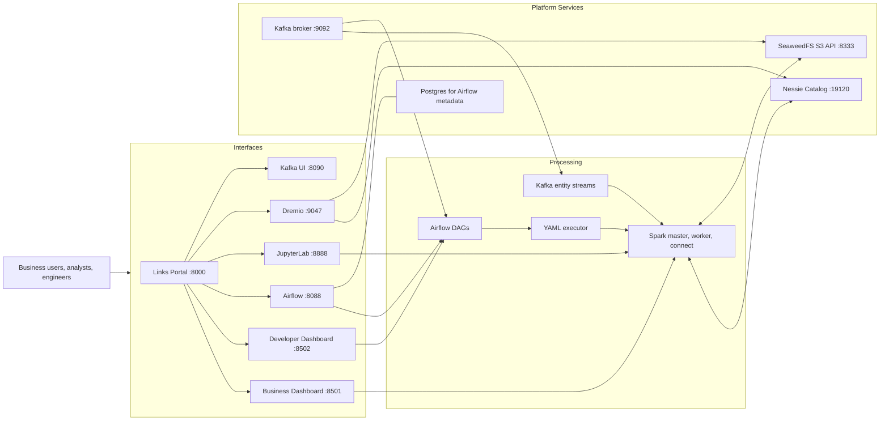

# Framework Overview, System Design & Tech Stack

> Quick links: [Overview](index.md) | [Data Model](data-model-risk-metrics.md) | [Interfaces](platform-interfaces-and-operations.md) | [Runbook](runbooks.md) | [Production Setup](production_setup.md) | [Testing](testing.md)

This page combines framework overview and architecture in one place.

## What This Platform Runs

The platform supports two coordinated execution paths:

1. Batch orchestration through Airflow for repeatable end-to-end runs.
2. Event-driven ingestion through Kafka plus Spark Structured Streaming.

Both paths publish to Iceberg tables through Nessie Catalog.

## Architecture Principles

- Separate orchestration, compute, catalog, storage, and interface concerns.
- Keep risk assumptions explicit and configuration-driven.
- Keep pipeline logic metadata-driven through YAML definitions.
- Publish only after successful execution, with run traceability.

## Technology Stack

| Technology | Role |
| --- | --- |
| Apache Spark | Distributed transforms, aggregation, and table writes |
| Apache Iceberg | Analytical table format with partition/snapshot semantics |
| Project Nessie | Git-like versioned catalog for branch-isolated writes |
| SeaweedFS S3 API | Local object warehouse for Iceberg data files |
| Apache Airflow | Batch orchestration and DAG observability |
| Apache Kafka | Event-driven trigger and publish channels |
| FastAPI | Links portal and operational endpoints |
| Streamlit | Business and developer dashboards |
| JupyterLab | Interactive notebook analytics (PySpark) |
| Dremio | SQL exploration over Nessie/Iceberg |
| Docker Compose | Repeatable local multi-service platform |

## End-to-End Architecture

## Runtime Flow

## Execution Framework

Primary runtime entry points:

- Scripted end-to-end run: `scripts/run_risk_analytics_pipeline.ps1`
- Local Python, no Airflow: `scripts/run_local_python_no_airflow.py`
- DAG-triggered batch execution: `ra_createtables_and_data` -> `ra_stage_to_ods_orchestration` -> (`ra_<source>_<entity>_stage` -> `ra_<source>_<entity>_ods`) -> `ra_riskmetrics_eval_ods`
- DAG-triggered streaming execution: `ra_kafka_customer_stage` -> `ra_kafka_customer_ods` -> `ra_riskmetrics_eval_ods`

Core execution modules:

- `risk_analytics/yaml_executor.py`
- `risk_analytics/transformations/components.py`
- `jobs/run_source_to_ods_step.py`
- `jobs/run_risk_pipeline.py`

## Source-to-ODS Model

Namespaces:

- Stage: `nessie.risk_analytics_stage`
- ODS: `nessie.risk_analytics_ods`

Standardized ODS entities:

- `customer`
- `asset`
- `collateral`
- `deals`

Published output:

- `nessie.risk_analytics_ods.risk_metrics`

## Kafka Event Path in This Architecture

Kafka supports near-real-time entity ingestion and trigger signaling for the source-to-ODS architecture.

1. Entity events arrive on ingest topics (customer, asset, collateral, deals).
2. Kafka consumers process micro-batches and land rows in source/stage contracts.
3. Trigger events are published on `risk.pipeline.trigger`.
4. `ra_kafka_customer_stage` (an `AwaitMessageSensor` DAG) consumes the trigger and loads the customer STAGE micro-batch.
5. It triggers `ra_kafka_customer_ods`, which standardizes the micro-batch into the ODS contract.
6. `ra_kafka_customer_ods` triggers `ra_riskmetrics_eval_ods`, which reads ODS entities and publishes `risk_metrics`.

This keeps event-driven flow aligned with the same stage -> ODS -> risk model used by batch orchestration.

## Why This Design Works

- Declarative YAML keeps business transformations readable.
- Shared executor keeps behavior consistent across pipelines.
- Versioned catalog provides safer publication semantics.
- Multiple interfaces serve business, engineering, and analytics users on one governed data model.
