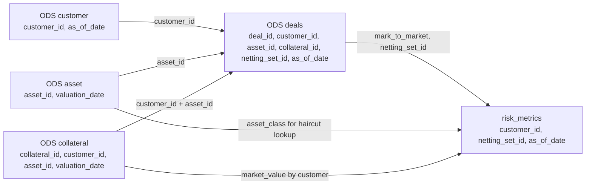
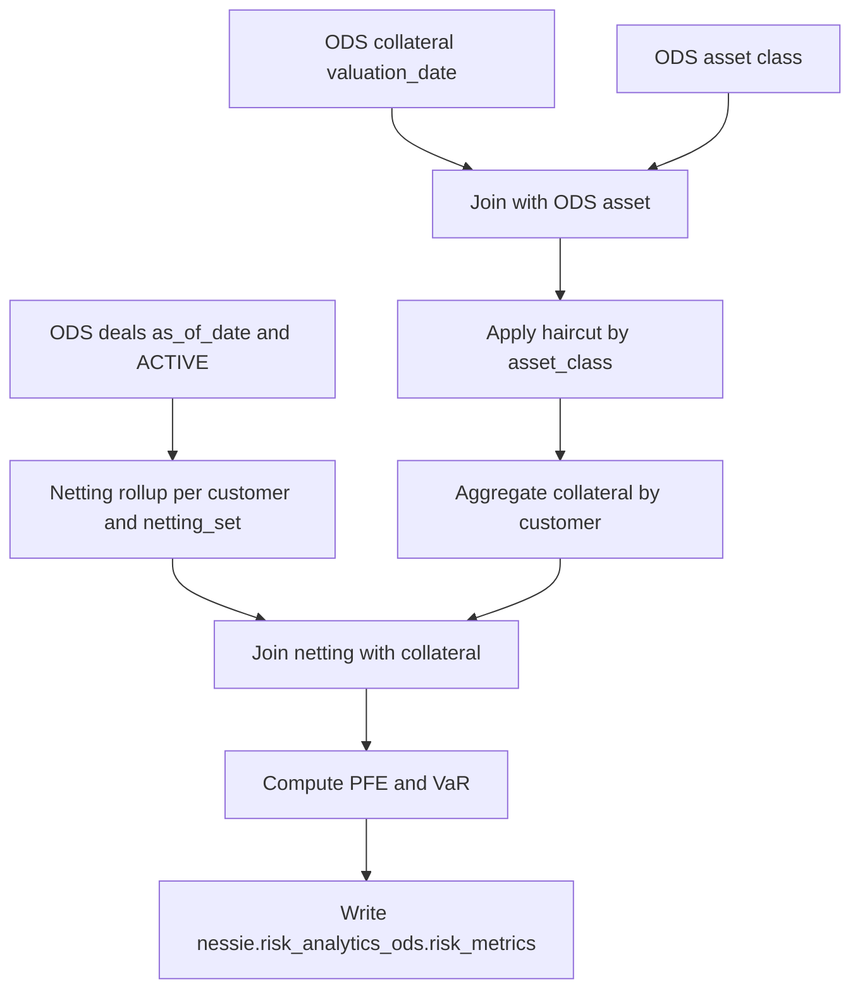

# Data Model and Risk Metrics

> Quick links: [Overview](index.md) | [Architecture](architecture.md) | [Interfaces](platform-interfaces-and-operations.md) | [Runbook](runbooks.md) | [Production Setup](production_setup.md) | [Testing](testing.md)

This page explains the active data model, table lineage, and metric derivation logic used to produce `nessie.risk_analytics_ods.risk_metrics`.

## Active Entity Model

The active source-to-ODS flow standardizes four entities:

- `customer`
- `asset`
- `collateral`
- `deals`

There is no standalone product entity in the active ODS risk path. Volatility defaults and other risk assumptions are configuration-driven.

Kafka ingestion feeds customer, asset, collateral, and deals entity streams into the source tables, then STAGE and ODS, before risk processing. See [Kafka Streaming Contracts](#kafka-streaming-contracts).

## Table Layers and Contracts

| Layer | Namespace | Purpose | Example tables |
| --- | --- | --- | --- |
| Source | `nessie.risk_analytics` | Raw or near-raw ingestion contracts | `deals`, source landing tables |
| Stage | `nessie.risk_analytics_stage` | Source-specific normalization boundary | `customer_stage_sourcea`, `deals_stage_sourceb` |
| ODS | `nessie.risk_analytics_ods` | Standard business contracts across sources | `customer`, `asset`, `collateral`, `deals` |
| Published metrics | `nessie.risk_analytics_ods` | Query-ready risk output | `risk_metrics` |

## Kafka Streaming Contracts

There are no Kafka-only tables. Streaming and batch share the same Iceberg contracts: the consumer
appends to the source tables in `nessie.risk_analytics`, and the same STAGE and ODS YAML pipelines
then process those rows. This is why a streamed micro-batch and a file-based batch load produce
identical ODS output.

`jobs/kafka_entity_consumer.py` (the `kafka-entity-stream` service) subscribes to the ingest topics
with Spark Structured Streaming, decodes each JSON payload with the entity's schema, drops rows with
a null key column, and appends:

| Ingest topic | Target Iceberg table | Key column | Date column used for the trigger |
| --- | --- | --- | --- |
| `risk.customer.ingest` | `nessie.risk_analytics.customer` | `customer_id` | `as_of_date` |
| `risk.asset.ingest` | `nessie.risk_analytics.asset` | `asset_id` | `valuation_date` |
| `risk.collateral.ingest` | `nessie.risk_analytics.collateral` | `collateral_id` | `valuation_date` |
| `risk.deals.ingest` | `nessie.risk_analytics.deals` | `deal_id` | `as_of_date` |

Message payloads use the source contract columns listed in
[Source Contracts](#source-contracts-nessierisk_analytics); the consumer casts them to the target
types, so dates and decimals may be sent as strings.

Two control topics carry no data, only signals:

- `risk.pipeline.trigger`: one message per entity touched by a micro-batch, carrying `entity`,
  `as_of_date`, and `source` (payload built by `risk_analytics/kafka_events.py`). Each
  `ra_kafka_<entity>_stage` sensor matches only its own entity.
- `risk.metrics.published`: emitted after a successful risk run with `as_of_date`, `run_id`, and
  `row_count`.

Example payloads, CLI/Python producer snippets, and the full topic-to-DAG matrix are in
[Kafka Runtime Details](platform-interfaces-and-operations.md#kafka-runtime-details).

Micro-batches trigger every 30 seconds, start from the latest offsets, and checkpoint at
`/tmp/checkpoints/kafka_entity_stream`, so restarting the service replays only from its last
committed offsets. An empty batch publishes no trigger event.

## Table and Column Reference

### Source Contracts (`nessie.risk_analytics`)

These tables are raw or near-raw landing contracts used as source inputs for stage transforms.

| Table | Core columns |
| --- | --- |
| `customer` | `customer_id`, `customer_name`, `legal_entity_id`, `rating`, `country_code`, `entity_type`, `active_flag`, `as_of_date` |
| `asset` | `asset_id`, `isin`, `asset_class`, `issuer`, `currency`, `market_value`, `valuation_date` |
| `collateral` | `collateral_id`, `customer_id`, `asset_id`, `agreement_id`, `collateral_type`, `quantity`, `market_value`, `currency`, `valuation_date` |
| `deals` | `deal_id`, `trade_id`, `customer_id`, `asset_id`, `collateral_id`, `netting_set_id`, `product_type`, `trade_date`, `maturity_date`, `currency`, `notional`, `mark_to_market`, `status`, `as_of_date`, `volatility`, `fixed_rate`, `strike`, `option_type` |

### Stage Contracts (`nessie.risk_analytics_stage`)

Stage tables are source-specific normalized outputs. They preserve business columns and add ingestion metadata.

| Table pattern | Notes |
| --- | --- |
| `customer_stage_sourcea`, `customer_stage_sourceb` | Source customer columns + `source_system`, `ingest_timestamp` |
| `asset_stage_sourcea`, `asset_stage_sourceb` | Source asset columns + `customer_id` (nullable where unavailable), `source_system`, `ingest_timestamp` |
| `collateral_stage_sourcea`, `collateral_stage_sourceb` | Source collateral columns + `source_system`, `ingest_timestamp` |
| `deals_stage_sourcea`, `deals_stage_sourceb` | Source deal columns + `source_system`, `ingest_timestamp` |

### ODS Contracts (`nessie.risk_analytics_ods`)

ODS tables are standardized merged contracts across sources.

| Table | Merge key | Core columns |
| --- | --- | --- |
| `customer` | `customer_id`, `as_of_date` | Customer attributes + `source_system`, `ingest_timestamp` |
| `asset` | `asset_id`, `valuation_date` | Asset attributes + `customer_id`, `source_system`, `ingest_timestamp` |
| `collateral` | `collateral_id`, `valuation_date` | Collateral attributes + `source_system`, `ingest_timestamp` |
| `deals` | `deal_id`, `as_of_date` | Deal attributes (`customer_id`, `asset_id`, `collateral_id`, `netting_set_id`, `mark_to_market`, `volatility`, etc.) + metadata |

### Published Risk Output (`nessie.risk_analytics_ods.risk_metrics`)

| Column | Meaning |
| --- | --- |
| `risk_run_id` | Unique run identifier |
| `as_of_date` | Business reporting date |
| `customer_id` | Customer key |
| `netting_set_id` | Netting set key within customer |
| `gross_exposure` | Sum of positive deal mark-to-market |
| `netting_exposure` | Netted mark-to-market floored at zero |
| `collateral_value_after_haircut` | Haircut-adjusted collateral value |
| `pfe` | Potential future exposure |
| `var` | Value at Risk |
| `calculation_timestamp` | Risk calculation timestamp |
| `source_branch` | Nessie source branch used for publication |

## Table-Level Relationship Flow

## Lineage to `risk_metrics`

## End-to-End Example (Table Level)

For `as_of_date = 2026-07-18`:

1. Batch seeding or the Kafka consumer appends source records into `nessie.risk_analytics.customer|asset|collateral|deals`.
2. Stage transforms write source-specific normalized tables in `nessie.risk_analytics_stage.*`.
3. ODS merges consolidate source records into `nessie.risk_analytics_ods.customer|asset|collateral|deals`.
4. Risk pipeline reads ODS deals and collateral+asset joins, computes metrics, and writes `nessie.risk_analytics_ods.risk_metrics`.

## Risk Logic Used

The formulas live in one place only, the YAML pipeline
`transform/source_to_ods/risk_metrics_pipeline_source_to_ods.yaml`, which
`jobs/run_risk_pipeline.py` executes through the YAML executor. Editing that file changes the
published metrics; there is no parallel Python implementation to keep in sync.

### Definitions

- `deal_exposure = max(mark_to_market, 0)`
- `gross_exposure = sum(deal_exposure)` by `(customer_id, netting_set_id)`
- `netting_exposure = max(sum(mark_to_market), 0)` by `(customer_id, netting_set_id)`
- `collateral_value_after_haircut = sum(market_value * (1 - haircut))` by `customer_id`
- `pfe = max(netting_exposure * pfe_multiplier - collateral_value_after_haircut, 0)`
- `var = netting_exposure * volatility * var_confidence_z_score`

### Configuration Inputs

The formulas use values from `config/platform.yaml`:

- `risk.pfe_multiplier`
- `risk.var_confidence_z_score`
- `risk.default_volatility`
- `risk.collateral_haircuts` map by asset class

## Metric Dictionary

| Metric | Business meaning | Grain |
| --- | --- | --- |
| `gross_exposure` | Sum of positive deal mark-to-market before netting benefit | Customer + Netting set + As-of date |
| `netting_exposure` | Netted mark-to-market floored at zero | Customer + Netting set + As-of date |
| `collateral_value_after_haircut` | Collateral value after asset-class haircuts | Customer + As-of date |
| `pfe` | Potential future exposure after collateral offset | Customer + Netting set + As-of date |
| `var` | Simplified Value at Risk based on exposure, volatility, and z-score | Customer + Netting set + As-of date |

## Worked Example

Assume one customer/netting set on one date:

| Input | Value |
| --- | --- |
| Mark-to-market values across deals | `120`, `-20`, `40` |
| Gross exposure | `max(120,0) + max(-20,0) + max(40,0) = 160` |
| Netting exposure | `max(120 - 20 + 40, 0) = 140` |
| Collateral market value | `80` |
| Haircut (effective) | `0.10` |
| Collateral after haircut | `80 * (1 - 0.10) = 72` |
| PFE multiplier | `1.25` |
| Volatility | `0.20` |
| VaR z-score | `2.33` |

Derived output:

- `pfe = max(140 * 1.25 - 72, 0) = 103`
- `var = 140 * 0.20 * 2.33 = 65.24`

## Output Columns in `risk_metrics`

- `risk_run_id`
- `as_of_date`
- `customer_id`
- `netting_set_id`
- `gross_exposure`
- `netting_exposure`
- `collateral_value_after_haircut`
- `pfe`
- `var`
- `calculation_timestamp`
- `source_branch`

These fields are designed to keep each run traceable and audit-friendly.
