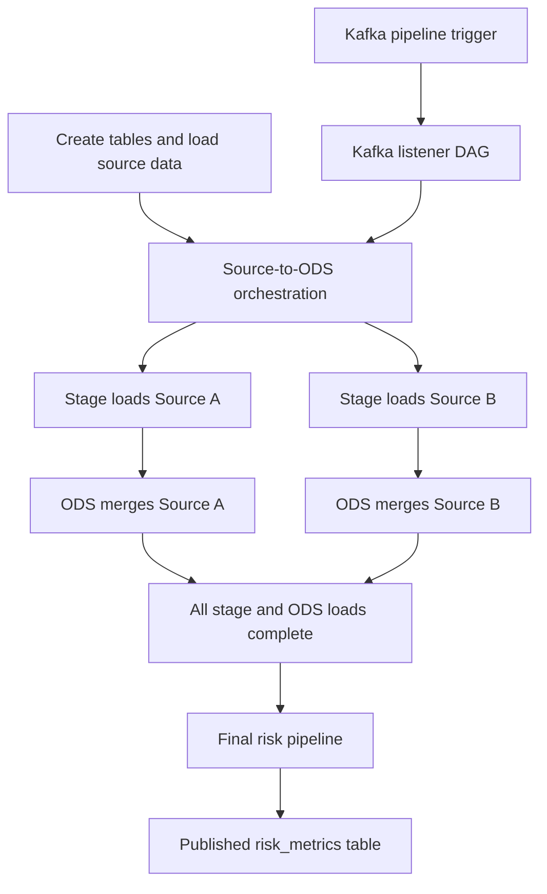
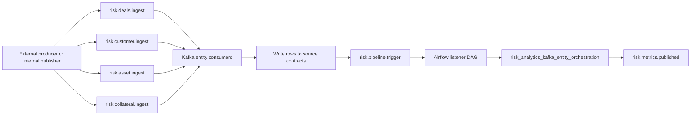

# Platform Interfaces and Operations

> Quick links: [Overview](index.md) | [Architecture](architecture.md) | [Data Model](data-model-risk-metrics.md) | [Runbook](runbooks.md) | [Production Setup](production_setup.md) | [Testing](testing.md)

This page consolidates all user-facing and operator-facing interfaces in one place, including setup notes, container images, key configuration, and practical usage.

## Interface Summary

| Interface | URL | Service | Image | Primary users |
| --- | --- | --- | --- | --- |
| Links Portal (FastAPI) | `http://localhost:8000` | `links-api` | `risk-analytics/ui:3.11.11` | All users |
| Business Dashboard | `http://localhost:8501` | `business-ui` | `risk-analytics/ui:3.11.11` | Business and risk users |
| Developer Dashboard | `http://localhost:8502` | `developer-ui` | `risk-analytics/ui:3.11.11` | Data engineers |
| Airflow | `http://localhost:8088` | `airflow-webserver` | `risk-analytics/airflow:2.10.5` | Platform operators |
| Dremio | `http://localhost:9047` | `dremio` | `dremio/dremio-oss:26.0.5` | Analysts and data engineers |
| Kafka UI | `http://localhost:8090` | `kafka-ui` | `provectuslabs/kafka-ui:v0.7.2` | Platform operators |
| JupyterLab | `http://localhost:8888` | `notebook` | `risk-analytics/notebook:3.11.11` | Analysts and engineers |

## Global Setup Dependencies

- Start platform: `docker compose up --build -d`
- Shared object warehouse: SeaweedFS S3 API (`http://seaweedfs:8333`)
- Versioned catalog: Nessie (`http://nessie:19120/api/v2`)
- Spark execution: master (`:7077`), Spark Connect (`:15002`)
- Required env baseline from `.env`:
  - `AWS_ACCESS_KEY_ID`
  - `AWS_SECRET_ACCESS_KEY`
  - `AIRFLOW_ADMIN_USER`
  - `AIRFLOW_ADMIN_PASSWORD`

## Runbook and Local Execution Modes

This section clarifies the difference between Runbook Mode A/B/C and local Python `--docker-mode` options.

### Runbook Modes (PowerShell helper)

Runbook modes use:

- `scripts/run_risk_analytics_pipeline.ps1`

| Mode | Command shape | Platform startup behavior | Use when |
| --- | --- | --- | --- |
| Mode A | `-PlatformMode first-build` | Starts platform with build (`docker compose up --build -d`) | First clone, image changes, dependency changes |
| Mode B | `-PlatformMode offline` | Strict offline startup (`docker compose up -d --no-build --pull never`), fails if images are missing | Routine runs with cached images |
| Mode C | No `-PlatformMode` flag | Defaults to `offline`; if required services are already running, startup is skipped and execution continues | Fast rerun on an already-running stack |

Notes:

- In Mode C, if services are not running, the script applies offline startup logic.
- Required services are checked before pipeline execution.

### Local Python Modes (no-Airflow runner)

Local modes use:

- `scripts/run_local_python_no_airflow.py --docker-mode <mode>`

| Local mode | Docker behavior | Use when |
| --- | --- | --- |
| `fresh` | `docker compose down -v` then `docker compose up --build -d` | Clean environment reset and rebuild |
| `reuse` | `docker compose up -d --no-build` | Reuse existing containers/images without rebuild |
| `none` | Skips Docker startup | Platform is already running and managed separately |

Quick examples:

```powershell
# Mode A (first build)
.\scripts\run_risk_analytics_pipeline.ps1 -AsOfDate 2026-07-18 -PlatformMode first-build

# Mode B (strict offline)
.\scripts\run_risk_analytics_pipeline.ps1 -AsOfDate 2026-07-18 -PlatformMode offline

# Mode C (default; skips startup if already running)
.\scripts\run_risk_analytics_pipeline.ps1 -AsOfDate 2026-07-18

# Local runner using reused Docker services
.\.venv\Scripts\python.exe .\scripts\run_local_python_no_airflow.py --as-of-date 2026-07-18 --docker-mode reuse
```

PowerShell execution policy note:

If you see `running scripts is disabled on this system` (`PSSecurityException`), run this in the same PowerShell session and retry:

```powershell
Set-ExecutionPolicy -Scope Process -ExecutionPolicy Bypass
```

## One-Time Setup Checklist (All Tools)

| Interface | One-time setup required? | What to configure once | Where it is configured |
| --- | --- | --- | --- |
| Links Portal (FastAPI) | No | None; links are injected from container environment variables | `docker-compose.yml` (`links-api` env block) |
| Business Dashboard | No | None; reads published ODS tables once platform and pipeline are running | Container runtime (`business-ui`) |
| Developer Dashboard | No | None; uses existing Airflow/Spark/Nessie endpoints from shared env | Container runtime (`developer-ui`) |
| Airflow | Yes (first platform bootstrap) | Admin user and Kafka connection are created by init service | `airflow-init` command in `docker-compose.yml` |
| Dremio | Yes (first Dremio login) | Nessie source registration + S3-compatible storage properties | Dremio UI (Datasets -> Add Source -> Nessie) |
| Kafka UI | No | None; cluster is pre-wired to `kafka:9092` in compose | `kafka-ui` environment config in `docker-compose.yml` |
| JupyterLab | No | None for local default mode; token/password already disabled for dev | Notebook container command in `docker-compose.yml` |

Notes:

- If you run `docker compose down -v`, one-time UI metadata is reset and must be redone for tools that store state (especially Dremio).
- Airflow init tasks run automatically during bootstrap; if credentials are changed in `.env`, recreate Airflow metadata volume and rerun init.

## Links Portal (FastAPI)

Purpose:

- Central landing page to access all interfaces and API endpoints.
- Lightweight service discovery for demos and operations.

Key configuration:

- URL environment variables in `docker-compose.yml`:
  - `BUSINESS_UI_URL`
  - `DEVELOPER_UI_URL`
  - `NOTEBOOK_URL`
  - `DREMIO_URL`
  - `AIRFLOW_URL`
  - `KAFKA_UI_URL`

Usage:

- Open `http://localhost:8000` and navigate to target interface.
- Use health endpoint for quick checks: `http://localhost:8000/health`.

## Business Dashboard

Purpose:

- Consume published risk outputs (`PFE`, `VaR`, netting/gross exposure) for business-facing review.

Depends on:

- `nessie.risk_analytics_ods.risk_metrics`
- ODS dimensions such as `nessie.risk_analytics_ods.customer`

Validation commands:

```powershell
docker compose exec spark-master /opt/spark/bin/spark-sql -e "SELECT COUNT(*) AS risk_metrics_rows FROM nessie.risk_analytics_ods.risk_metrics"
docker compose exec spark-master /opt/spark/bin/spark-sql -e "SELECT MAX(as_of_date) AS latest_as_of FROM nessie.risk_analytics_ods.risk_metrics"
```

Expected outcome:

- Non-zero row count after a successful run.
- Latest as-of date reflects the most recent pipeline execution.

## Developer Dashboard

Purpose:

- Control-plane for pipeline execution, YAML validation/preview, and runtime checks.

Typical workflow:

1. Choose the target as-of date.
2. Trigger source-to-ODS orchestration or selective execution.
3. Preview YAML resolution with runtime parameters.
4. Validate pipeline structure before execution.
5. Verify output counts and branch metadata.

Depends on:

- Airflow availability for DAG trigger paths.
- Spark/Nessie endpoints for metadata and data checks.

## Airflow

Purpose:

- Orchestration and observability for repeatable platform runs.

Core DAGs:

- `risk_analytics_create_tables_and_load_data`
- `risk_analytics_source_to_ods_orchestration`
- `risk_analytics_pipeline`
- `risk_analytics_kafka_listener`

How it is run:

- `airflow-webserver` and `airflow-scheduler` services run continuously.
- `airflow-init` performs DB migration, user creation, and Kafka connection setup.

Key configuration:

- `AIRFLOW__CORE__EXECUTOR=LocalExecutor`
- `SPARK_MASTER_URL=spark://spark-master:7077`
- `SPARK_REMOTE=sc://spark-connect:15002`
- `KAFKA_BOOTSTRAP_SERVERS=kafka:9092`

Useful commands:

```powershell
docker compose exec airflow-webserver airflow dags list
docker compose exec airflow-webserver airflow dags list-runs -d risk_analytics_pipeline
docker compose exec airflow-webserver airflow dags trigger risk_analytics_pipeline --conf '{"as_of_date":"2026-07-18"}'
```

Expected results:

- Triggered DAG appears in run history.
- Task graph shows successful completion of calculation and publish steps.

Airflow dependency flow:



## Dremio

Purpose:

- SQL exploration over Nessie-managed Iceberg tables.

Setup notes:

- Service starts at `http://localhost:9047`.
- Register or verify Nessie source in Dremio.

One-time source setup (required on first Dremio login):

1. Open Dremio at `http://localhost:9047` and complete the first-user registration.
2. Go to **Datasets** -> **Add Source** -> **Nessie**.
3. Set source name to `risk_analytics_nessie`.
4. Set Nessie endpoint to `http://nessie:19120/api/v2` and authentication to **None**.
5. In **Storage**, choose **AWS** and use:

  | Setting | Value |
  | --- | --- |
  | AWS root path | `risk-analytics-lakehouse/warehouse` |
  | Authentication method | `AWS Access Key` |
  | AWS access key | `risk_analytics_admin` |
  | AWS access secret | `risk_analytics_local_development_secret` |

  If you changed credentials in `.env`, use those values instead.
6. In **Other: Connection Properties**, add:

  | Name | Value |
  | --- | --- |
  | `fs.s3a.path.style.access` | `true` |
  | `fs.s3a.endpoint` | `seaweedfs:8333` |
  | `dremio.s3.compat` | `true` |

7. Save. The source should show branch `main` and schemas such as `risk_analytics_ods`.

Quick validation query:

```sql
SELECT COUNT(*) AS row_count
FROM risk_analytics_nessie.risk_analytics_ods.risk_metrics;
```

Example queries:

```sql
SELECT COUNT(*) AS row_count
FROM nessie.risk_analytics_ods.risk_metrics;

SELECT as_of_date, customer_id, netting_set_id, pfe, var
FROM nessie.risk_analytics_ods.risk_metrics
ORDER BY calculation_timestamp DESC
LIMIT 20;
```

Result interpretation:

- First query confirms data availability.
- Second query confirms recency, grain, and metric distribution.

### Dremio Query Results Snapshot (Example)

Expected shape from `risk_metrics` query:

| as_of_date | customer_id | netting_set_id | pfe | var |
| --- | --- | --- | ---: | ---: |
| 2026-07-18 | CP001 | NS-APEX | 103.00 | 65.24 |
| 2026-07-18 | CP002 | NS-NOVA | 41.30 | 22.11 |

Screenshot guidance:

1. Run the two SQL queries above in Dremio SQL Runner.
2. Capture one screenshot showing both the SQL and first result grid.
3. Save the image under `docs/assets/dremio/` and reference it from this section.

## Kafka UI

Purpose:

- Operational visibility of topics, partitions, and consumer groups.

Topics to verify:

- `risk.deals.ingest`
- `risk.customer.ingest`
- `risk.asset.ingest`
- `risk.collateral.ingest`
- `risk.pipeline.trigger`
- `risk.metrics.published`

Setup notes:

- Kafka broker image: `confluentinc/cp-kafka:7.7.1`
- Kafka UI image: `provectuslabs/kafka-ui:v0.7.2`
- Host broker endpoint: `localhost:29092`

Typical usage:

- Confirm inbound entity events on ingest topics.
- Confirm trigger events consumed by listener flow.
- Confirm published summary events from risk pipeline.

Kafka event flow:



### Kafka Runtime Details

Broker and UI:

- Broker service: `kafka` (`confluentinc/cp-kafka:7.7.1`)
- Internal broker endpoint: `kafka:9092`
- Host broker endpoint: `localhost:29092`
- UI service: `kafka-ui` (`provectuslabs/kafka-ui:v0.7.2`) at `http://localhost:8090`

Entity ingest consumer:

- Service: `kafka-entity-stream`
- Runtime file: `jobs/kafka_entity_consumer.py`
- Consumes topics: `risk.deals.ingest`, `risk.customer.ingest`, `risk.asset.ingest`, `risk.collateral.ingest`
- Writes to source contracts: `nessie.risk_analytics.deals`, `customer`, `asset`, `collateral`
- Publishes trigger topic: `risk.pipeline.trigger`

Airflow DAG sequence after trigger:

1. `risk_analytics_kafka_listener` consumes `risk.pipeline.trigger`
2. Listener triggers `risk_analytics_kafka_entity_orchestration`
3. Orchestration runs stage + ODS loads for `customer`, `asset`, `collateral`, `deals`
4. Orchestration triggers `risk_analytics_pipeline`
5. Pipeline publishes summary event to `risk.metrics.published`

### Kafka Topic to Table to DAG Matrix

| Kafka topic | Consumer/service | Target table | Trigger topic | Airflow DAG chain |
| --- | --- | --- | --- | --- |
| `risk.customer.ingest` | `kafka-entity-stream` (`jobs/kafka_entity_consumer.py`) | `nessie.risk_analytics.customer` | `risk.pipeline.trigger` | `risk_analytics_kafka_listener` -> `risk_analytics_kafka_entity_orchestration` -> `risk_analytics_pipeline` |
| `risk.asset.ingest` | `kafka-entity-stream` (`jobs/kafka_entity_consumer.py`) | `nessie.risk_analytics.asset` | `risk.pipeline.trigger` | `risk_analytics_kafka_listener` -> `risk_analytics_kafka_entity_orchestration` -> `risk_analytics_pipeline` |
| `risk.collateral.ingest` | `kafka-entity-stream` (`jobs/kafka_entity_consumer.py`) | `nessie.risk_analytics.collateral` | `risk.pipeline.trigger` | `risk_analytics_kafka_listener` -> `risk_analytics_kafka_entity_orchestration` -> `risk_analytics_pipeline` |
| `risk.deals.ingest` | `kafka-entity-stream` (`jobs/kafka_entity_consumer.py`) | `nessie.risk_analytics.deals` | `risk.pipeline.trigger` | `risk_analytics_kafka_listener` -> `risk_analytics_kafka_entity_orchestration` -> `risk_analytics_pipeline` |
| `risk.pipeline.trigger` | `risk_analytics_kafka_listener` (Airflow sensor) | XCom payload (`as_of_date`) | N/A | Triggers `risk_analytics_kafka_entity_orchestration` |
| `risk.metrics.published` | Downstream consumers / monitoring | Event payload (`as_of_date`, `run_id`, `row_count`) | N/A | Produced by `risk_analytics_pipeline` completion |

### Example Kafka Payloads

Deals (`risk.deals.ingest`):

```json
{
  "deal_id": "D001",
  "trade_id": "T001",
  "customer_id": "CP001",
  "asset_id": "A100",
  "collateral_id": "C100",
  "netting_set_id": "NS-APEX",
  "product_type": "SWAP",
  "trade_date": "2026-07-18",
  "maturity_date": "2031-07-18",
  "currency": "USD",
  "notional": 10000000.00,
  "mark_to_market": 600000.00,
  "status": "ACTIVE",
  "as_of_date": "2026-07-18",
  "volatility": 0.20,
  "fixed_rate": 0.035,
  "strike": 0.0,
  "option_type": "NA"
}
```

Customer (`risk.customer.ingest`):

```json
{
  "customer_id": "CP001",
  "customer_name": "Alpha Capital",
  "legal_entity_id": "LE-CP001",
  "rating": "A",
  "country_code": "US",
  "entity_type": "BANK",
  "active_flag": true,
  "as_of_date": "2026-07-18"
}
```

### Kafka Commands (CLI)

List topics:

```powershell
docker compose exec kafka kafka-topics --bootstrap-server localhost:9092 --list
```

Produce one deals event:

```powershell
docker compose exec kafka /bin/sh -c "printf '{\"deal_id\":\"D001\",\"trade_id\":\"T001\",\"customer_id\":\"CP001\",\"asset_id\":\"A100\",\"collateral_id\":\"C100\",\"netting_set_id\":\"NS-APEX\",\"product_type\":\"SWAP\",\"trade_date\":\"2026-07-18\",\"maturity_date\":\"2031-07-18\",\"currency\":\"USD\",\"notional\":10000000.0,\"mark_to_market\":600000.0,\"status\":\"ACTIVE\",\"as_of_date\":\"2026-07-18\",\"volatility\":0.2,\"fixed_rate\":0.035,\"strike\":0.0,\"option_type\":\"NA\"}\n' | kafka-console-producer --bootstrap-server kafka:9092 --topic risk.deals.ingest"
```

Consume trigger events:

```powershell
docker compose exec kafka kafka-console-consumer --bootstrap-server kafka:9092 --topic risk.pipeline.trigger --from-beginning --timeout-ms 10000
```

### Kafka Commands (Python Producer)

```python
from confluent_kafka import Producer
import json

p = Producer({"bootstrap.servers": "localhost:29092"})

deals_event = {
    "deal_id": "D001",
    "trade_id": "T001",
    "customer_id": "CP001",
    "asset_id": "A100",
    "collateral_id": "C100",
    "netting_set_id": "NS-APEX",
    "product_type": "SWAP",
    "trade_date": "2026-07-18",
    "maturity_date": "2031-07-18",
    "currency": "USD",
    "notional": 10000000.0,
    "mark_to_market": 600000.0,
    "status": "ACTIVE",
    "as_of_date": "2026-07-18",
    "volatility": 0.2,
    "fixed_rate": 0.035,
    "strike": 0.0,
    "option_type": "NA",
}

p.produce("risk.deals.ingest", value=json.dumps(deals_event).encode("utf-8"))
p.flush(5)
```

## JupyterLab (PySpark Notebooks)

Purpose:

- Interactive PySpark analysis using Spark Connect to query the same governed tables.

Setup notes:

- Notebook service sets `SPARK_REMOTE=sc://spark-connect:15002`.
- Open curated notebooks under `notebooks/`.

Example code:

```python
from pyspark.sql import SparkSession

spark = SparkSession.builder.remote("sc://spark-connect:15002").getOrCreate()

spark.sql("""
SELECT as_of_date, customer_id, netting_set_id, pfe, var
FROM nessie.risk_analytics_ods.risk_metrics
ORDER BY calculation_timestamp DESC
LIMIT 10
""").show(truncate=False)
```

Expected outcome:

- Query returns latest published rows from ODS risk metrics.

## Quick Operational Health Checks

```powershell
docker compose ps --all
docker compose logs --tail 120 business-ui
docker compose logs --tail 120 developer-ui
docker compose logs --tail 120 airflow-webserver
docker compose logs --tail 120 kafka-ui
```

If an interface is unavailable, rebuild only affected UI/API services:

```powershell
docker compose up -d --build business-ui developer-ui links-api
```

## Where to Go Next

- Event flow and topic design: [Framework Overview, System Design & Tech Stack](architecture.md)
- End-to-end run commands: `docs/runbooks.md`
- Risk metric formulas and lineage: `docs/data-model-risk-metrics.md`
