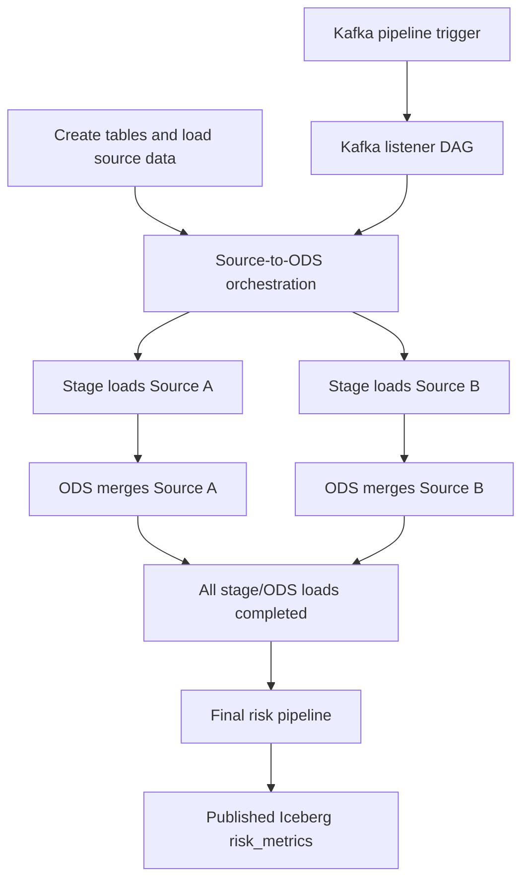

# Airflow Operations Guide

## Workflow Inventory

| DAG | Responsibility | Downstream dependency |
| --- | --- | --- |
| `risk_analytics_create_tables_and_load_data` | Creates the Iceberg namespace and tables, then seeds deterministic source data. | Triggers source transformation orchestration. |
| `risk_analytics_source_to_ods_orchestration` | Runs stage then ODS loads for customer, asset, collateral, and deals across SourceA/SourceB. | Triggers final risk pipeline with source-to-ODS data model. |
| `risk_analytics_stage_load` | Executes one parameterized stage load (`entity`, `source`, `as_of_date`). | Returns completion to source-to-ODS orchestration DAG. |
| `risk_analytics_ods_load` | Executes one parameterized ODS merge (`entity`, `source`, `as_of_date`). | Returns completion to source-to-ODS orchestration DAG. |
| `risk_analytics_pipeline` | Runs the branch-safe final risk calculation and publishes `risk_metrics`. | Emits completion event when Kafka is configured. |
| `risk_analytics_kafka_listener` | Listens for pipeline-trigger messages from Kafka and starts the orchestration flow. | Starts source-to-ODS orchestration. |

## Dependency Flow

## Trigger a Run

Use the Developer UI to trigger source-to-ODS orchestration for a selected as-of date, or use Airflow directly:

1. Open [Airflow](http://localhost:8088) and sign in with the credentials from `.env`.
2. Select `risk_analytics_create_tables_and_load_data` for a complete seeded run, or `risk_analytics_source_to_ods_orchestration` when source data already exists.
3. Select **Trigger DAG**, provide `{"as_of_date": "2026-07-18"}` as configuration, and confirm.
4. Follow the run graph through all source transforms to the final risk calculation.

## Monitor and Troubleshoot

Use the Airflow Grid and Graph views to inspect task state, duration, retries, and task logs. The most useful diagnostic order is:

1. Confirm the bootstrap task completed and the source tables contain data.
2. Inspect the failed stage or ODS task; YAML validation and missing input paths appear in that task’s log.
3. Confirm all trigger tasks in the orchestration DAG reached success before investigating the final pipeline.
4. Review the final pipeline log for Nessie branch creation, Spark write, and merge activity.
5. Run the health-check utility with `--check-iceberg` to confirm that the published table is queryable.

For Kafka-driven execution, inspect `risk.pipeline.trigger` in Kafka UI and confirm the listener DAG consumed the message. Review consumer-group offsets when a message exists but the expected orchestration run did not appear.

The platform initializer creates Airflow's `kafka_default` connection with `kafka:9092`. In a production deployment, create the equivalent connection through Airflow’s secrets backend and use authenticated, encrypted broker settings.

## Developer UI Coverage

The Developer UI is an effective control plane for selecting an as-of date, triggering orchestration, viewing Nessie references, and validating or executing YAML transformations. It is not a replacement for the native Airflow UI: it does not expose the task graph, logs, retries, durations, run history, or task-level failure controls required for operational diagnosis.

For interview walkthroughs, the Developer UI is the best starting point and Airflow is the proof point for orchestration transparency. A production control plane should link to Airflow and may summarize run status, but should not duplicate the full scheduler interface.
