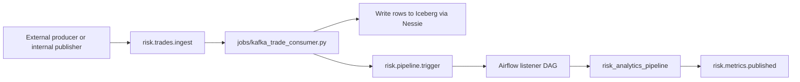

# Kafka Integration

Kafka provides optional event-driven ingestion and trigger signaling on top of the standard Airflow batch orchestration.

## Why Kafka Is Used Here

Airflow remains the orchestrator for deterministic batch runs, while Kafka is used for:

- Near-real-time trade ingest
- Trigger signal propagation
- Publish notifications after risk output updates

## Topics and Purpose

| Topic | Purpose |
| --- | --- |
| `risk.trades.ingest` | Incoming trade-event payloads |
| `risk.pipeline.trigger` | Trigger signal for downstream orchestration |
| `risk.metrics.published` | Summary event after successful risk publication |

## Services and Images

- Broker: `confluentinc/cp-kafka:7.7.1`
- UI: `provectuslabs/kafka-ui:v0.7.2`
- Streaming consumer runtime: `trade-stream` on `risk-analytics/spark:4.1.3`

Ports:

- Broker host access: `localhost:29092`
- Kafka UI: `http://localhost:8090`

## End-to-End Event Flow



## Message Shape Example

```json
{
  "trade_id": "T999",
  "customer_id": "CP001",
  "netting_set_id": "NS-APEX",
  "trade_date": "2026-07-25",
  "maturity_date": "2031-07-25",
  "currency": "USD",
  "notional": 10000000.00,
  "mark_to_market": 600000.00,
  "status": "ACTIVE",
  "as_of_date": "2026-07-25"
}
```

## Airflow Listener Setup

The listener DAG depends on `kafka_default` connection.

Create or verify:

```powershell
docker compose exec airflow-webserver airflow connections add kafka_default --conn-type kafka --conn-extra '{"bootstrap.servers": "kafka:9092"}'
```

Unpause listener DAG:

```powershell
docker compose exec airflow-webserver airflow dags unpause risk_analytics_kafka_listener
```

## Operational Checks

List topics:

```powershell
docker compose exec kafka kafka-topics --bootstrap-server localhost:9092 --list
```

Expected topics:

- `risk.trades.ingest`
- `risk.pipeline.trigger`
- `risk.metrics.published`

Check listener and pipeline DAG runs:

```powershell
docker compose exec airflow-webserver airflow dags list-runs -d risk_analytics_kafka_listener
docker compose exec airflow-webserver airflow dags list-runs -d risk_analytics_pipeline
```

## When to Disable Kafka Path

If you only need deterministic batch runs, you can pause/stop Kafka-driven flow.

```powershell
docker compose stop trade-stream
docker compose exec airflow-webserver airflow dags pause risk_analytics_kafka_listener
```

Re-enable when needed:

```powershell
docker compose start trade-stream
docker compose exec airflow-webserver airflow dags unpause risk_analytics_kafka_listener
```
